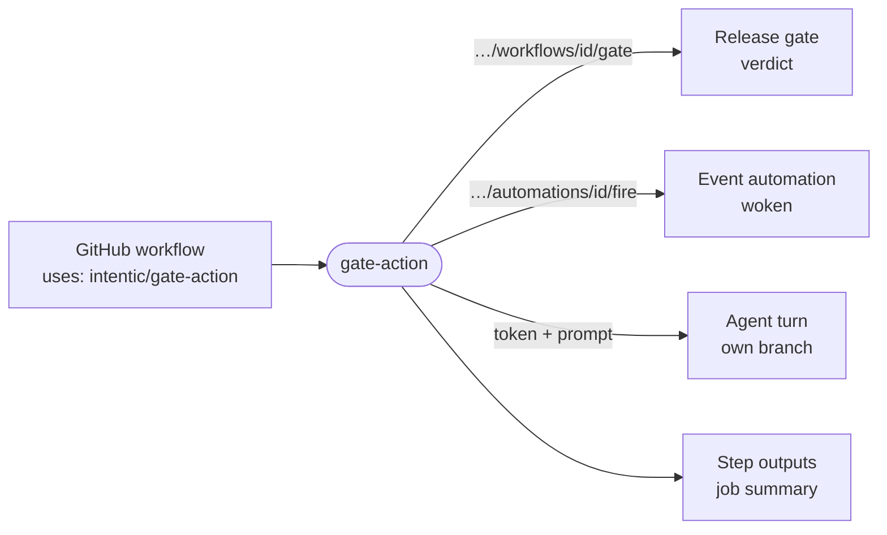

# gate-action

The GitHub Action that connects a workflow step to an intentic sandbox: wait on a release gate, wake an event automation, or run an agent with a prompt.



- The end of the `url` path picks the door. `/workflows/<id>/gate` holds the step until a verdict arrives;
  `/automations/<id>/fire` posts the event payload and returns at once. With a `token` input, `url` is the sandbox's
  own address and `prompt` runs as an agent turn through [gate](../gate)'s `runExchange`.
- Runs on GitHub's `node24` runtime from `dist/index.mjs`, one esbuild bundle that needs no `node_modules`. It speaks
  the runner protocol (`INPUT_*` variables, `GITHUB_OUTPUT`, `GITHUB_STEP_SUMMARY`, `::error::`) without
  `@actions/core`.
- A `blocked` verdict passes the step unless `blocked-as: failure`. A prompt run ends `completed`, `parked` or
  `failed`, and a stopped turn or a refused land counts as `failed`. Exit 2 is never a verdict: the wiring broke, or a
  run's deadline passed while the agent keeps working.
- Workflows use the public `intentic/gate-action` repository, not this directory.
  `_tools/scripts/release/publish-action.sh` copies `action.yml`, the bundle and
  [marketplace/README.md](marketplace/README.md) there on each release and moves the floating major tag.

## Key files

- [action.yml](action.yml) — inputs, outputs and runtime; the file the runner reads.
- [src/action.ts](src/action.ts) — pure decisions: input parsing, door detection, default request, outputs, step exit.
- [src/main.ts](src/main.ts) — the process: environment in, runner files and an exit code out.
- [src/action.test.ts](src/action.test.ts) — the behaviour a workflow relies on, by example.
- [marketplace/README.md](marketplace/README.md) — the README of the public action repository.

## Commands

```sh
pnpm --filter @intentic/gate-action build   # tsgo, then the bundle at dist/index.mjs
pnpm --filter @intentic/gate-action test
```
