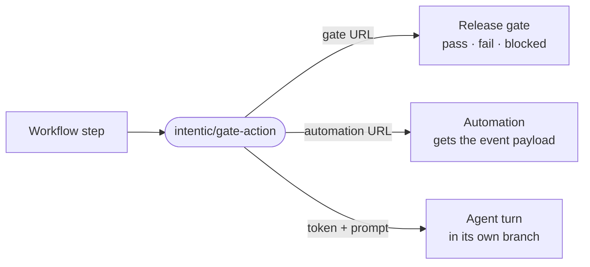

# Intentic Agent Gate

Runs your intentic sandbox's agent from a GitHub workflow: block a release on an agent-judged gate, wake an automation with the event, or drive the agent with a prompt.



- The `url` input decides what the step does. A release gate URL (`…/workflows/<id>/gate`) waits for the verdict. An
  automation webhook URL (`…/automations/<id>/fire`) sends the workflow's event payload and returns at once. The
  sandbox's own address plus `token` runs `prompt` as an agent turn and waits for it to settle.
- Gate and webhook URLs carry their own token, so store them as repository secrets. Copy them from the gate or the
  automation in your sandbox; mint control tokens under Sandbox → Access → API tokens.
- A `blocked` verdict (the gate could not judge) passes the step unless `blocked-as: failure`. A step that fails with
  an `::error::` annotation and no verdict means the wiring is wrong: token, URL, network or the daily ceiling.
- This repository is a release artifact built from
  [intentic/intentic](https://github.com/intentic/intentic/tree/main/_sandbox/gate-action). Open issues and pull
  requests there.

## Usage

```yaml
name: Release gate
on: [push]
jobs:
  gate:
    runs-on: ubuntu-latest
    steps:
      - uses: intentic/gate-action@v1
        with:
          url: ${{ secrets.INTENTIC_GATE_URL }}
```

Drive the agent directly instead:

```yaml
      - uses: intentic/gate-action@v1
        with:
          url: https://sandbox-….intentic.dev
          token: ${{ secrets.INTENTIC_TOKEN }}
          prompt: "Review this change: ${{ github.event.pull_request.html_url || github.sha }}"
```

## Inputs

| Input | Default | What it does |
| --- | --- | --- |
| `url` | required | Gate or automation URL, or the sandbox's address when `token` is set. |
| `token` | | Control token (drive scope; land scope for `land`). Selects the prompt run. |
| `prompt` | | What to ask the agent, for a run with `token`. |
| `agent` | sandbox default | Which agent runs the prompt (`claude`, `codex`, …). |
| `land` | `false` | Merge the run's branch into the sandbox's main tree when it completes. |
| `request` | commit, branch, PR link | What to tell a gate; an automation gets the event payload by default. |
| `wait` | `1800` | Seconds to wait for a verdict or a run. |
| `blocked-as` | `success` | What a `blocked` verdict does to the step: `success` or `failure`. |

## Outputs

| Output | Set by | Meaning |
| --- | --- | --- |
| `outcome` | gate | `pass`, `fail` or `blocked`. |
| `reason` | gate | The gate's sentence explaining the verdict. |
| `run-id` | gate | The run inside the sandbox, where the transcript lives. |
| `value` | gate | The judged value behind the verdict, when there is one. |
| `status` | run | `completed`, `parked`, `failed` or `timeout`. A stopped turn or a land the sandbox refuses is `failed`. |
| `conversation-id` | run | The conversation the run opened. |
| `branch` | run | The branch the run worked on. |
| `summary` | run | The run's title, failure sentence or the card it parked on. |
| `landed` | run | Whether the branch landed in the main tree; set only when `land` is `true`. A land your own land rules hold stays `completed` with `landed` false. |
