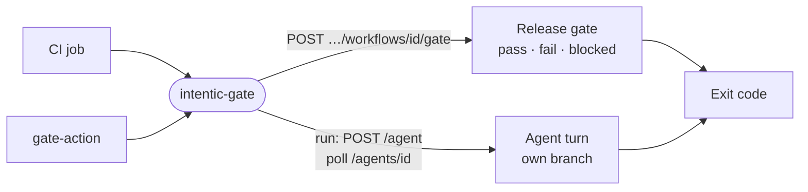

# gate

A small CLI, `intentic-gate`, that lets any CI pipeline wait on a sandbox release gate's verdict or run an agent turn, and exit on the result.



- Runs in CI, usually cold under `npx`, so it carries no schema library: `readVerdict` and `readCard` check the
  daemon's answers by hand, and the tests pin them to the contract's schemas.
- The default command POSTs what the pipeline knows (arguments, or stdin) to a gate URL copied from the sandbox, which
  holds the connection until the gated workflow judges it. `pass` exits 0, `fail` exits 1, and `blocked` exits 0
  unless `--blocked` says otherwise, because a gate that could not judge is not a broken build.
- `intentic-gate run` starts a turn with a control token in its own conversation and branch, polls until it settles,
  and with `--land` merges it. A stopped turn or a refused land is `failed`; a land the owner's rules hold stays
  `completed`, not landed.
- Exit 2 is never a verdict. It means the exchange failed (bad token, no such gate, the daily ceiling, the network, a
  card status this gate does not know), or a run's deadline passed while the agent keeps working in the sandbox.
- The package also exports these functions to [gate-action](../gate-action), which wraps them for GitHub.

## Usage

```sh
git log -1 | intentic-gate --url "$INTENTIC_GATE_URL"
intentic-gate run --url "$INTENTIC_URL" --token "$INTENTIC_TOKEN" "Review this change"
```

## Key files

- [src/cli.ts](src/cli.ts) — the process: read stdin, one exchange, print the verdict, exit.
- [src/gate.ts](src/gate.ts) — gate door: argument parsing, the request dial, `readVerdict` and `exitOf`.
- [src/run.ts](src/run.ts) — `runExchange`: start a turn, poll its card, land it, map the ending to an exit code.
- [src/gate.test.ts](src/gate.test.ts) — the verdict reader held against `GateVerdictSchema`.

## Commands

```sh
pnpm --filter @intentic/gate test
```
