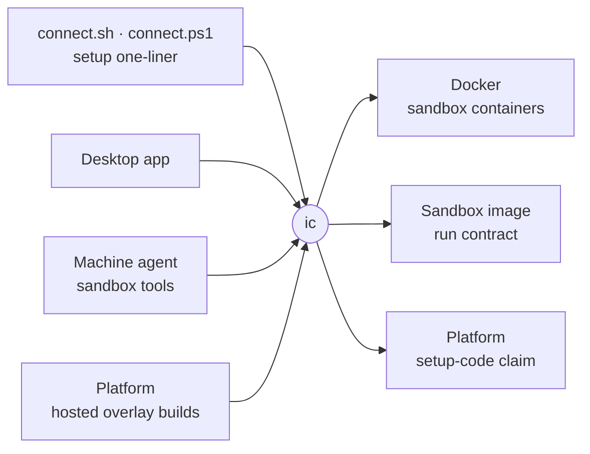

# ic

The host-side CLI that starts, updates, diagnoses and removes intentic sandbox containers on the machine that runs them, and gets Docker there first.



- Runs on the host: a laptop, a server or a hosted machine, never inside a sandbox, which cannot see its siblings.
  The bootstrap shims download a fresh static binary on every run; the desktop app and the machine agent call the
  installed one. An agent reaches it through a connected device's sandbox tools.
- `ic sandbox connect <code>` redeems the setup code from the platform and brings a sandbox up. `update`, `prepare`,
  `rollback`, `rebuild` and `reshape` swap or restart the container while keeping `/work` and `/history`; `remove`
  moves the data to a trash that `restore` brings back and `purge` empties early.
- `ic sandbox reshape <slug> … --later` saves a memory, CPU, privileged or GPU change instead of restarting for it
  (`sandbox-<slug>.shape` beside the channel record). The next recreate applies it and clears it: an update,
  rollback, rebuild, a plain `reshape`, or a Restart from the Devices view. `--forget` drops it.
- `ic sandbox doctor` walks the reachability chain (machine, container, daemon, platform, edge) and names the broken
  link with its fix.
- The image owns its `docker run` flags. `ic` asks the image for its run command (`contract.rs`) instead of
  writing one, so a flag change ships with the image.
- `ic docker prepare` checks and, with consent, installs what Docker needs; `ic machine enroll` makes the host a deploy
  target; `ic runner up` starts a runner container for a parent sandbox.

## Key files

- [src/main.rs](src/main.rs) — every command and flag, with its help text.
- [src/sandbox/connect.rs](src/sandbox/connect.rs) — the setup one-liner's flow after Docker: claim, launch, reachability.
- [src/sandbox/recreate.rs](src/sandbox/recreate.rs) — every image swap (update, prepare, rollback, rebuild, reshape) as one flow.
- [src/contract.rs](src/contract.rs) — asks the image for its `docker run` command.
- [src/sandbox/doctor.rs](src/sandbox/doctor.rs) — the reachability chain and its findings.
- [src/prepare/mod.rs](src/prepare/mod.rs) — `ic docker prepare`: facts, plan, fixes.

## Commands

```sh
cargo test --manifest-path _sandbox/ic/Cargo.toml
bash _tools/scripts/build/build-ic.sh linux-x64   # release binaries into _sandbox/ic/dist-bin/
```
