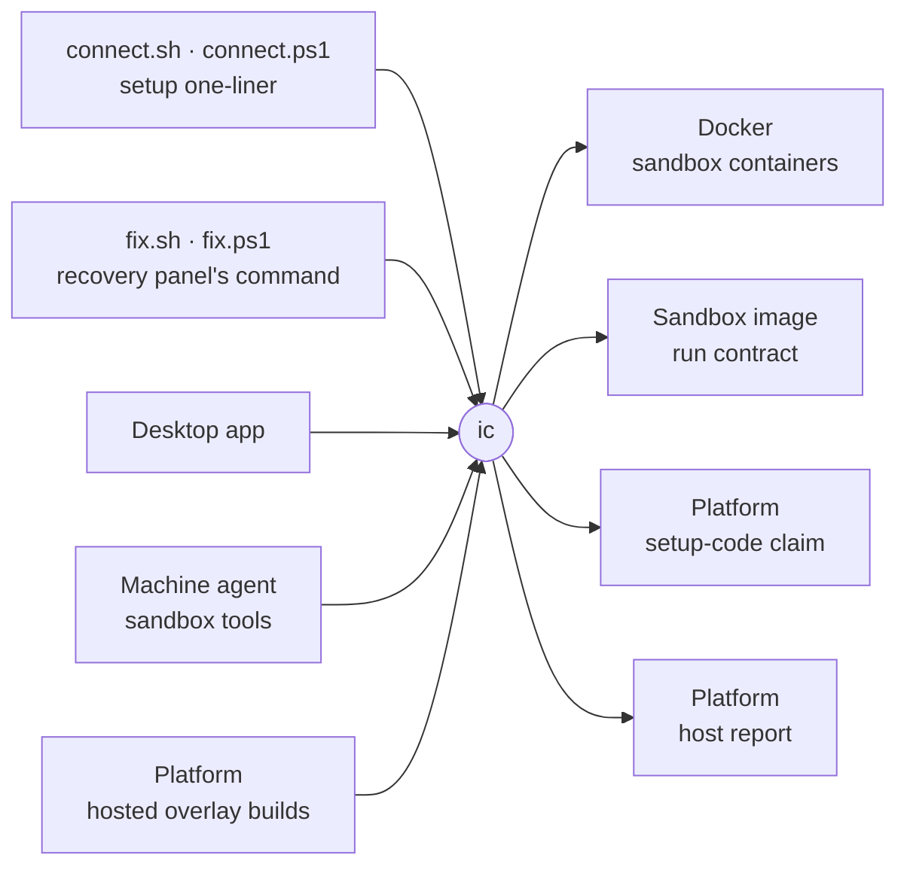

# ic

The host-side CLI that starts, updates, diagnoses and removes intentic sandbox containers on the machine that runs them, and gets Docker there first.


```mermaid
flowchart LR
    shim["connect.sh · connect.ps1<br/>setup one-liner"] --> ic(["ic"])
    fixshim["fix.sh · fix.ps1<br/>recovery panel's command"] --> ic
    desktop["Desktop app"] --> ic
    machine["Machine agent<br/>sandbox tools"] --> ic
    hosted["Platform<br/>hosted overlay builds"] --> ic
    ic --> docker["Docker<br/>sandbox containers"]
    ic --> image["Sandbox image<br/>run contract"]
    ic --> claim["Platform<br/>setup-code claim"]
    ic --> report["Platform<br/>host report"]
```

- Runs on the host: a laptop, a server or a hosted machine, never inside a sandbox, which cannot see its siblings.
  The bootstrap shims download a fresh static binary on every run; the desktop app and the machine agent call the
  installed one. An agent reaches it through a connected device's sandbox tools.
- `ic sandbox connect <code>` redeems the setup code from the platform and brings a sandbox up. `update`, `prepare`,
  `rollback`, `rebuild` and `reshape` swap or restart the container while keeping `/work` and `/history`; `remove`
  moves the data to a trash that `restore` brings back and `purge` empties early.
- A sandbox for one folder of the owner's (`SYNC_REMOTE_DIR=/work/<name>` with `SYNC_PROJECT=1`, beside `SYNC_DIR`)
  is checked before anything starts (`project_dir.rs`, the contract's name rule), hands the sync installer both, and
  tells the container `SANDBOX_PROJECT_DIR`, which the run contract replays across every later swap.
- **ic is the one host authority for what runs and what should run.** Every door onto a sandbox's container (the
  machine agent, the desktop app, the web's pasted fallback lines) calls ic's verbs rather than docker: `start`,
  `stop` and `restart` power the tunnel sidecar with its sandbox, and `ic sandbox list --json` answers each
  sandbox's state, its share as docker enforces it, the shape it runs with, the shape saved for its next restart and
  the update staged for it, in the sandbox contract's `DeviceSandbox` shape.
- Before a swap touches the running container, it pre-flights the target image's state conversions against
  read-only mounts of the container's data (`/work`, `/history`, and `/agent-auth` where the container has it: the run
  contract's `DATA_MOUNTS`, held to it by a golden test) (`preflight.rs`) and refuses if one would fail;
  `--skip-preflight` overrides. `prepare` records the staged image's plan in the marker it leaves the sandbox, the
  planner's line verbatim, so the update card says what an update converts before anyone accepts it. While it runs it
  also keeps `update-preparing.json` there (`preparing.rs`): its step and how far the pull has got, rewritten every
  few seconds and removed when it ends, so the card draws the download in progress instead of a button for it. It also refuses a
  run line that would put the sandbox on other storage than it has (`storage.rs`: a renamed or dropped volume would
  otherwise boot a healthy-looking sandbox on empty volumes).
- **Nothing old is let go until the new version has proved itself.** A swap parks the old container, and a new version
  that never answers, never commits its state journal or reports its conversion failed is undone at once. After that
  first check the old container stays parked for a 24-hour probation (`probation.rs`): `ic sandbox watch`, which the
  machine agent runs every minute while a probation is on, puts it back by itself (a rename and a start, nothing
  downloaded or built) when the new version keeps crashing, never becomes ready, or loses the tunnel the old one had.
  The same look finishes or undoes a swap that died halfway (Ctrl-C, a dropped SSH session, an agent restart, a
  reboot): the channel record names the swap in flight before anything stops. What happened is written to the
  sandbox's `/history/update-outcome.json` (`outcome.rs`), which its daemon shows the owner. The dogfood `dev` loop
  keeps no probation. `IC_PROBATION_SECONDS` and `IC_WATCH_GRACE_SECONDS` shorten both windows for the nightly drill.
- **The ways back.** `rollback` returns to `previous` (pressing it twice goes forward again); up to two older builds
  are kept behind it when the disk allows, and `ic sandbox versions` lists them for `rollback --to <version>`. A
  release nothing kept is downloaded by its version tag. Every build a swap leaves is pinned under a tag no other flow
  writes, chosen by image identity (`identity.rs`): an environment overlay is labelled with the base it was built on,
  since its base tag moves whenever anything on the machine pulls it.
- **One record, one run at a time.** The channel record is fsynced, and copied onto the sandbox's own `/history`
  volume so every `ic` that drives the same Docker engine (the Windows side and a WSL distro, `sudo`) reads the same one
  (`mirror.rs`). A per-sandbox lock (`lock.rs`) orders ic runs from a terminal, the desktop app and the machine agent;
  a background run skips a busy sandbox instead of waiting.
- **Backups outside Docker.** `ic sandbox backup` copies `/work` and `/history` into an encrypted, incremental restic
  repository in `~/.intentic/backups/<slug>/`, keyed by `~/.intentic/keys/backup-<slug>.key` (`backup.rs`), so a Docker
  reset or a lost WSL disk does not take the sandbox with it. The machine agent runs it daily (`--auto`); every swap
  takes a quick one of the state an update converts first. `backups` lists them, and `backup-restore` puts one into a
  folder or back into a sandbox's volumes.
- `ic sandbox tidy` removes what updates leave behind (images and records of sandboxes that are gone, superseded
  environment builds, the trash past its window) and names volumes that belong to no sandbox without touching them.
  `ic sandbox reset-owner <slug>` moves an unreadable owner file aside, the one way back in for an owner the daemon
  locks out because it cannot read who owns it.
- A sandbox's **shape** is the owner's own ask for memory, CPUs, privileged and GPU, always whole
  ([`shape.rs`](src/shape.rs)). `ic sandbox shape <slug> … --when now` restarts onto it; `--when next-restart` checks
  it against the image's run contract (a bad value is refused here, not by the next update) and saves it as the
  channel record's `desired_*` keys, next to what `prepare` staged. The next restart through ic applies it and drops
  it in the same record write that names the new image: `start`, `restart`, an update, a rollback, a rebuild or a
  `reshape`. Docker restarting the container by itself (`--restart unless-stopped`) does not. `--forget` drops it.
  Programs pass the shape as the sandbox contract's own object, one `--set FIELD=JSON` per field (`--set
  memoryGib=12 --set cpus=null`), and `--when` takes the contract's `nextRestart` too, so no caller spells a flag per
  field and a field ic does not know is refused. `--memory`/`--cpus`/`--privileged`/`--gpus` on `shape`, and the
  `reshape` verb with `--later`/`--forget`, are the older spellings, kept for machine agents released before
  `--set`: a shim fetches a fresh ic on every run, so an older agent can be driving this one. They can go once no
  agent older than the release carrying `--set` is left; a `sandbox-<slug>.shape` delta an older ic saved is
  converted into the record the first time it is read, then deleted.
- `ic sandbox logs [<slug>] [--tail N]` prints the tail of a sandbox's own log, both streams: what the machine
  agent's Logs button and `sandbox_logs` tool read.
- `ic sandbox fix [<slug>]` ([src/sandbox/fix/mod.rs](src/sandbox/fix/mod.rs)) checks every layer between this
  machine and a sandbox in order, each with a deadline: Windows prerequisites, Docker Desktop, the engine, WSL, disk,
  the container, its daemon, its registration, the network, the tunnel and the machine agent. It applies the fixes that
  are safe unasked (starting Docker Desktop, tidying, starting a sandbox nobody stopped, finishing a cut-off swap,
  restarting one whose registration gave up), asks on the terminal before the rest, and re-checks after each. Exit 0
  is healthy or fixed, 1 something is left, 3 a fix needed a yes nobody could give, 4 Windows has to restart or sign
  out first. `--auto` is the machine agent's run (safe fixes only, nothing asked), `--yes` and `--accept <ids>` give
  consent in advance, and `--json` prints machine lines for the desktop app. Given the code the browser's recovery
  panel minted (`--code`, or `FIX_CODE` through the `/fix` shim), or holding a sandbox's report key, it posts its
  progress to the platform's host report, which the page mirrors. The platform never sends it anything.
  `ic sandbox doctor` is the same engine, read-only.
- The image owns its `docker run` flags. `ic` asks the image for its run command (`contract.rs`) instead of
  writing one, so a flag change ships with the image.
- `ic docker prepare` checks and, with consent, installs what Docker needs; `ic machine enroll` makes the host a deploy
  target; `ic runner up` starts a runner container for a parent sandbox.

## Key files

- [src/main.rs](src/main.rs) — every command and flag, with its help text.
- [src/sandbox/connect.rs](src/sandbox/connect.rs) — the setup one-liner's flow after Docker: claim, launch, reachability.
- [src/sandbox/recreate.rs](src/sandbox/recreate.rs) — every image swap (update, prepare, rollback, rebuild, reshape) as one flow.
- [src/sandbox/probation.rs](src/sandbox/probation.rs) — the watch that finishes interrupted swaps and rolls a failing new version back.
- [src/contract.rs](src/contract.rs) — asks the image for its `docker run` command.
- [src/prepare/mod.rs](src/prepare/mod.rs) — `ic docker prepare`: facts, plan, fixes.

## Commands

```sh
cargo test --manifest-path _sandbox/ic/Cargo.toml --workspace   # ic, and the bounded-capture crate the desktop app shares
bash _tools/scripts/build/build-ic.sh linux-x64   # release binaries into _sandbox/ic/dist-bin/
```
