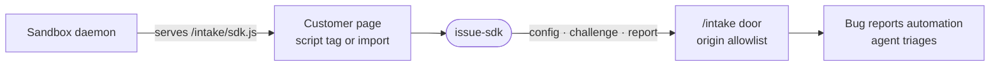

# issue-sdk

The bug reporter a website or app embeds to send crashes and user-written reports to a sandbox's bug-report intake, where an agent picks them up.



- Runs in a visitor's browser on someone else's site, so it must never break the page. Every path swallows its own
  failures, the error handlers observe through `addEventListener`, and breadcrumbs are a bounded ring buffer that
  skips request bodies, keystrokes and `console.log`.
- One entry, two builds (`vite.config.ts`): `sdk.js`, an IIFE that boots from its own `<script data-automation>` tag
  and exposes `window.Intentic`, and `sdk.mjs` for `init()` from a bundler.
- The daemon serves `sdk.js` itself (`_sandbox/sandbox/src/issues/`), so the SDK and the routes it calls always ship
  together. Build this package before the daemon can serve it.
- `data-release` names the commit the build came from, so the agent reads the real source at that commit and no
  sourcemaps are needed. Browsers are admitted by origin; an app with no origin presents an ingest `key`.
- `dialog.ts` is the only UI: an optional report dialog in a shadow root with no launcher button, opened from the
  host's own link through `openReportDialog`.

## Key files

- [src/main.ts](src/main.ts) — both ways in: script-tag boot and `init`, plus the `window.Intentic` global.
- [src/client.ts](src/client.ts) — `createClient`: capture, breadcrumbs, proof of work and sending.
- [src/capture.ts](src/capture.ts) — uncaught errors and unhandled rejections turned into reports.
- [src/breadcrumbs.ts](src/breadcrumbs.ts) — the bounded trail of what happened before a crash.
- [src/transport.ts](src/transport.ts) — the calls against the daemon's `/intake` routes.
- [src/dialog.ts](src/dialog.ts) — the optional report dialog element.

## Commands

```sh
pnpm --filter @intentic/issue-sdk build
pnpm --filter @intentic/issue-sdk test
```
