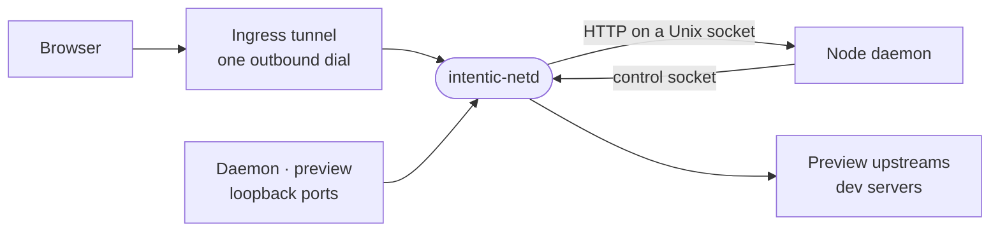

# netd

The sandbox's network daemon, named the Unix way (like sshd): a Rust binary that owns every port and the ingress tunnel, relays each request to the Node daemon or a preview, and keeps the daemon running.



- Relays with the edge's own code: the [relay](../../_shared/relay) crate (one exchange over any stream, one reading
  of a host, one list of hop-by-hop headers) and the tunnel crate are built by both.
- Runs as the container's main process. `docker-entrypoint.sh` execs `intentic-netd -- node … main.js`, and the
  netd starts Node as its child, in a process group of its own. A crash restarts Node with backoff while every
  listener and connection stays open, once the group is ended too: SIGTERM, then SIGKILL a second later, so a pooled
  agent, the translator or a turn's runtime the dead daemon started never runs on beside its replacement. Whatever is
  meant to outlive a restart starts in a group of its own (services, X displays, tmux panes). A Node that leaves a
  `ping` unanswered for 5 minutes has an event loop that is not turning at all, since a busy one answers within
  seconds: netd SIGKILLs it (its SIGTERM handler would need that loop) and restarts it as after a crash. A clean
  exit or a refused config ends netd, and with it the container. `docker run` gives the container a 30 s
  `--stop-timeout`, past the 25 s netd gives Node to stop and the 2 s it then gives every tunnel carrier, together, to
  close.
- Daemon replies expose Resource Timing to the origin their CORS response already permits, so the editor can read the
  negotiated HTTP protocol and reserve browser connections when multiplexing is unavailable.
- `route.rs` picks the target from the listener a request arrived on and the leftmost DNS label of its Host. On the
  preview port and the tunnel, `sandbox-<id>` is Node and every other label is a preview. The label rules are held to
  the contract's shared `hostnames.fixture.json`.
- Reachability is netd's own dial (`tunnel.rs`): two WebSockets at `/tunnel/v2`, `interactive` and `bulk`, each
  presenting the sandbox's grant and the daemon's transfer routes and then carrying yamux, and a QUIC connection beside
  them (`quic.rs`), dialled only once the edge's answer declares `quic` (`x-intentic-transports`). Either way the edge
  opens a stream per request, and netd serves every stream as one HTTP/1.1 connection (`Netd::serve_stream`), an
  upgrade included. A transfer rides the bulk socket over TCP and yields by itself over QUIC, so it never queues a
  keystroke. It never gives up for long, because it is the only way in. netd pings its sockets; the edge proves
  QUIC with a probe stream every 15 s, which netd answers before reading the stream as HTTP.
- One copy of a sandbox holds its tunnel (2026-10-05). netd mints an instance id once per process (it lives as
  long as the container), hands it to Node as `INTENTIC_INSTANCE`, and presents it on every dial with the machine the
  container's `HOST_LABEL`, `HOST_PLATFORM` and `HOST_ENV` name (`x-intentic-instance`, `x-intentic-host`, and in the
  QUIC hello). The edge refuses a second live copy (409 naming the holder, or close code 4009) rather than letting the
  two trade the tunnel every minute. Each carrier then paces its redials (`standing.rs`): a drop climbs the ladder from
  1 s to 30 s, starting again once a carrier answered one ping or probe rather than only after a minute (an idle timeout
  at 45 s never reached it); a displacement or a refusal stands back 60-120 s, drawn; three refusals in a row slow it
  to every 15 minutes and tell Node where the holder runs; a deletion (403 with the `unknown-sandbox` verdict, close
  code 4010, or QUIC's `Gone`) stops it for an hour. A dial the edge has not answered in 30 s is abandoned, the QUIC
  hello waits 15 s (past the edge's slowest answer; at 5 s the edge could register a connection netd had given
  up on) and is acknowledged before the edge registers it, and a dead accept loop closes its QUIC connection.
- Node hears where the tunnel stands on every change (`ToNode::Tunnel`): `connected`, netd's `reason` when it is
  not held, and `refused` when netd slowed or stopped (`elsewhere` with the holder's host, or `deleted`). Node logs
  each change with its reason and raises one push notification while another copy holds the tunnel (2026-10-05: Node
  logged "the ingress tunnel dropped" with no reason, once a minute for four hours).
- Terminals are netd's own: `GET /system/terminal` never reaches Node's HTTP. Node answers once what a socket may
  open, and netd serves it with one `tmux -C` client per session shared by every viewer; one that falls behind
  gets a snapshot instead of a backlog. The shared grid is the minimum columns and rows across connected viewers,
  recomputed on join, resize and leave, and applied to tmux only when it changes. A `grid` message tells every editor
  what to render; viewport requests stay separate from that grid. (2026-10-01: smallest-fits-all was chosen over
  largest-with-scaling to keep the editor's current font size and avoid a new scaling UI. Older editors ignore `grid`
  and still attach, though their local grid can differ; newer editors fall back to local fitting with older netd versions.)
  A terminal is a WebSocket however it arrives: a browser's over TCP, or one the
  editor speaks on a WebTransport stream, which the edge relays as the same HTTP/1.1 upgrade.
- Every address netd has is Node's word: its ports, the loopback certificate and the tunnel, sent over the control
  socket. netd writes the last of each down (`remember.rs`, `last-config.json` in the run directory, 0600) and applies
  them again when it starts, before any Node has spoken, and the next Node's word replaces them. A container whose
  daemon dies before it speaks (a module it cannot load) used to answer nobody at all, its vitals included, and its
  owner watched a spinner; restarted, it now answers on its ports and over its tunnel with the vitals that say it is
  crashing and netd's own "restarting" (2026-10-06). The file lives on the container's own filesystem, so it survives a
  restart and goes with a recreate, where the new container's first Node is the first word. It holds the tunnel's
  grant and the loopback key, neither reaching further than it did: the grant is in netd's own environment, the
  container's, which only root reads, and the key in the daemon's certificate store.
- The sandbox's proof of life is netd's too: `GET /system/vitals` on the daemon's host (`vitals.rs`) is answered
  before anything waits for Node, whether Node has not said hello yet, is up, or is being restarted, on whichever
  ports netd holds. netd also writes them to `/run/intentic/vitals.json` (browser-wire's `VITALS_FILE`) on every
  restart, every change of Node's link and once a minute, for a host that reaches the container but not its address:
  a fresh container whose daemon dies before naming netd's ports has no address to ask, and `ic`'s swap and probation
  and the hosted gate read the file there (2026-10-06). A netd from before the file is read off its log line instead,
  `the daemon crashed; restarting it`, as `dev-restart.sh` and `smoke-image.sh` do. It reports Node's
  link (`starting`, `up`, `restarting`), its lag, how many times netd restarted it in the last 10 minutes, the
  container's uptime, cgroup v2's `some avg10` pressure for cpu, memory and io, and the tunnel (`tunnel`: whether it is
  held, dialling, held by another copy and where, or deleted, whether QUIC is held, and how many times a held tunnel
  dropped in the last hour; 2026-10-05). The lag is the round trip of a
  `ping` netd sends over the control socket every 2 s once the previous one was answered, or how long the
  outstanding one has waited when that is longer, and Node answers it in the link itself. Any origin may read the
  answer and nothing may cache it, since it carries nothing of the workspace. (2026-09-30: the editor's only liveness
  signal was the heartbeat on Node's `/events` stream, which Node's event loop sends, so a sandbox starved by a build
  or by swap read as a dead one.) A Node that has not said its first hello 3 minutes after it started is treated as
  hung, killed and restarted like one that stopped answering pings (2026-10-05: one hung before its hello was never
  killed, since pings start at the hello).
- The change feed: netd keeps a generation per checkout Node reads git in, moved by one inotify instance on
  whatever a `git status` there reads, so Node answers an untouched checkout from memory.
- Node drives netd over the control socket: length-prefixed JSON frames on a Unix socket that push listen config
  and certificates, and either side asks the other a question under one envelope (an id, an answer or a refusal, five
  seconds' patience; netd's `ping` waits as long as its connection lasts). A reply netd cannot read refuses
  its own question and leaves the link up, which is how an older Node answers a question it does not know. A new
  connection becomes the link at its first frame that decodes (Node says hello last, once it serves HTTP) while no Node
  that said hello holds it; one whose first frame does not is refused and the live link stands, and one that spoke HTTP
  is told in HTTP that this is not the daemon's HTTP socket. (2026-10-04: an agent ran `curl --unix-socket` on the
  control socket, netd handed it the link at accept, and Node, reading its link closing as the box going down,
  stopped and took the container with it.) While a Node that said hello holds the link, a new connection is held back
  until its own hello, which takes the link only if it names a newer start (`INTENTIC_NODE_GENERATION`, which netd
  counts and sets on each Node it spawns); a copy naming the same start or none is refused, and a connection that lost
  the link is closed with nothing more it sends applied. Node itself takes netd's sockets only as the container's
  own daemon (or a local one): a guest whose netd the live owner dials refuses to start its netd door. The listener
  is rebound after repeated accept failures, and the change feed reopens its inotify instance with backoff after a
  read error instead of turning off for good (2026-10-05). netd owns every socket and byte, Node every decision about them: which terminal a socket
  opens onto (netd composes tmux's command), and what becomes of a preview request (an upstream to relay, a page
  to write, or the outbox to hand back), decided once when asked. [crates/netd-wire](crates/netd-wire) defines the frames, and nothing a browser sees;
  [crates/browser-wire](crates/browser-wire) defines what one does (the terminal's messages, the vitals, the
  WebTransport path, the edge's verdict), and the edge builds it too. Each crate's tests, and the tunnel crate's, write their TypeScript
  and a JSON manifest into `@intentic/sandbox-contract`, whose `contract.lock.json` pins the manifests.

## Key files

- [crates/netd/src/route.rs](crates/netd/src/route.rs) — which side answers a request.
- [crates/netd/src/supervise.rs](crates/netd/src/supervise.rs) — runs Node, restarts it and ends what it left, reaps orphans as PID 1.
- [crates/netd/src/tunnel.rs](crates/netd/src/tunnel.rs) — the ingress tunnel: grant, then a stream per request.
- [crates/netd/src/standing.rs](crates/netd/src/standing.rs) — where the tunnel stands for Node and the vitals, and
  each carrier's redial pace.
- [crates/netd/src/term/mod.rs](crates/netd/src/term/mod.rs) — a terminal socket from Node's plan to its close.
- [crates/netd-wire/src/lib.rs](crates/netd-wire/src/lib.rs) — the control socket's frames, their only definition.
- [crates/netd/tests/routes.rs](crates/netd/tests/routes.rs) — the real binary on real ports: routing, preview relay, TLS, upgrades.

## Commands

```sh
(cd _sandbox/netd && cargo test)          # the wire crates' tests also rewrite the contract's generated/ files
bash _tools/scripts/image/build-netd.sh   # the binary for the sandbox image, _shared/relay passed beside it
```
