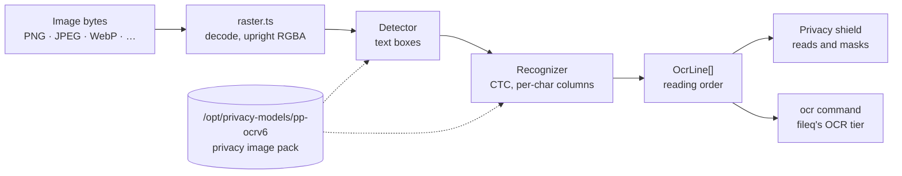

# ocr

Reads the text on an image on this machine with PaddleOCR's PP-OCRv6 run by onnxruntime-node: the privacy shield's text reader, and the sandbox image's `ocr` command.



- Nothing leaves the machine: no Python, no PaddlePaddle, no network. The medium detector and recognizer are the
  ONNX files PaddlePaddle publishes, and one recognizer covers 50 languages, Polish diacritics included.
- The models come with the `privacy` image pack, under `/opt/privacy-models/pp-ocrv6` (`PRIVACY_OCR_MODEL_DIR` points
  elsewhere). Without them the reader says so and nothing is read: `ocr --check` exits 2.
- The pre- and post-processing around the models is pinned to what PaddleOCR 3.7 and OpenCV answer for the same input,
  since a box a pixel off is a different crop for the recognizer. The tests hold those numbers and need no models.
- Each line carries where every character sits along it, which is what lets the shield paint over a value.
- Subpath exports keep the cost where it belongs: `./models` asks whether the reader is installed without loading a
  native library, while `./paddle-ocr` and `./raster` bring in onnxruntime-node and sharp.
- Private: the daemon depends on it for the shield, and the image links its `bin` to `/usr/local/bin/ocr`, which
  `fileq` shells out to.

(2026-10-06: this was `src/ocr/` inside the daemon until it became its own package. It imported nothing of the daemon,
and the command it ships ran out of the daemon's `dist/`.)

## Key files

- [src/paddle-ocr.ts](src/paddle-ocr.ts) — `loadTextReader`, `OcrLine` and `pageText`: detection, recognition, reading order.
- [src/models.ts](src/models.ts) — where the models live and whether they are installed.
- [src/raster.ts](src/raster.ts) — decoding an image and the OpenCV-matching resamplings.
- [src/text-detection.ts](src/text-detection.ts) — the detector's input size and the boxes its probability map becomes.
- [src/cli.ts](src/cli.ts) — the `ocr` command: one row per line, a form feed between images.

## Commands

```sh
pnpm --filter @intentic/ocr test
```
