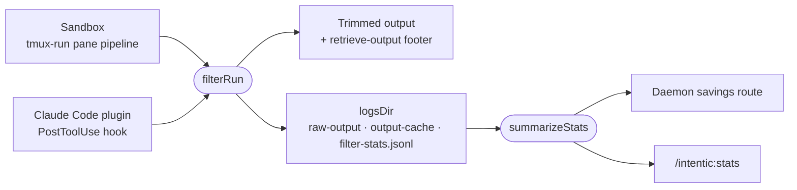

# output-cleaners

Trims a coding agent's Bash output before the model reads it, keeps the raw text retrievable, and ledgers what each cleaner saved.



- Plain node-builtin `.mjs` with hand-written `.d.mts` beside each, so the sandbox image copies the files as written
  (`/usr/local/bin/agent-output-filter`, `cleaners.mjs`, `retrieve-output`) while TypeScript consumers import them
  typed.
- `filterRun` is one command's whole pass with its inputs resolved. The sandbox's adapter is `main` in
  `agent-output-filter.mjs` (argv, `INTENTIC_OUTPUT_CLEANERS`, `INTENTIC_OUTPUT_HOLDOUT`, the pane log);
  the Claude Code plugin's is its PostToolUse hook. Both keep the same three things under `logsDir`.
- Success runs the matching command cleaners and the generic cap; a failure keeps its detail and only loses long
  repeated runs and anything past a generous tail. Every path redacts, and any error answers with the raw text.
- `filter-stats.mjs` is the only reading of the ledger: the daemon's savings route and the plugin's stats command
  both call `summarizeStats`, so the two reports cannot disagree.
- Secret values come from the sandbox's own stores (`secretValues`); outside a sandbox that list is empty and only the
  credential-shaped patterns redact. `surfaceForms` (raw, JSON-escaped, percent-encoded) is the daemon's too: its
  masking of tool results imports it from here, so the two lanes match the same forms of a value.

## Key files

- [src/cleaners.mjs](src/cleaners.mjs) — the cleaner registry, the spec parser and the repeat cache.
- [src/agent-output-filter.mjs](src/agent-output-filter.mjs) — `filterOutput`, `filterRun` and the sandbox's adapter.
- [src/filter-stats.mjs](src/filter-stats.mjs) — the savings summary every report shares.
- [src/retrieve-output.mjs](src/retrieve-output.mjs) — reads back what a footer said was elided.
- [bench/cleaner-bench.mjs](bench/cleaner-bench.mjs) — replays fixtures or real transcripts through cleaner configs.

## Commands

```sh
pnpm --filter @intentic/output-cleaners test
pnpm --filter @intentic/output-cleaners bench corpus ~/.claude/projects
```
