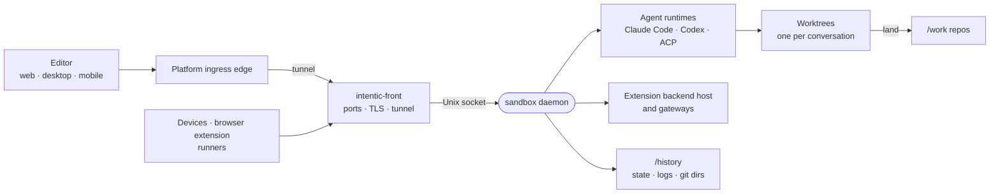

# sandbox

The Node daemon at the center of every sandbox: it runs coding agents in git worktrees, serves the workspace to the editor, and lands and checks their work.



- It runs as the child of `intentic-front` ([../front](../front)), which owns every port, the TLS certificate and
  the platform tunnel, and relays HTTP over a Unix socket. The daemon decides, the front binds.
- Two roots: `/work` is what agents edit; `/history` is the daemon's own (git dirs, worktrees, the conversation
  database, snapshots, logs) and sits outside `/work`.
- Routes are declared in `@intentic/sandbox-contract`, implemented in `*.routes.ts` and assembled in `src/router.ts`.
  `/events` pushes file, git and fleet changes to the browser.
- One turn: `agent/run/turn/turn-admission.ts` admits it, `turn-plan.ts` picks a runtime, it runs in the
  conversation's worktree (or the main tree, or a remote runner), and `conversations/land/land.ts` lands the result as
  uncommitted changes. Nothing checks the turn when it ends. `verify-landed.ts` asks the one land check
  (`services.landCheck`, `workspace/deps/verify-deps.ts`) to run the repository's check on the main tree in the
  background, and `conversations/land/land-breakage.ts` decides who is sent a red one. The lands waiting for a verdict and what
  the router holds or waits on live in the verify store, so a restart picks both up again.
- Archive is sticky: only a person's message un-archives a conversation. A turn the daemon starts itself (a retry,
  a nudge, an automation's thread) is refused on an archived one (`conversations/actor/conversation-decide.ts`), and a
  thread whose conversation was archived opens a fresh one instead.
- Extension code never runs in the daemon process; it runs in a supervised backend host and in declared processes.
  Both reach the daemon on one token per extension, held to its manifest's `permissions.daemon` (`auth/grants.ts`).
  The panel token that repo operator panels hold reaches no route that returns a stored secret.
- Every MCP server the daemon hosts for a turn (its browser routers, the machines and browsers it was granted, its
  extension cards' endpoints) is a mount at one door, `ALL /mcp/<name>` (`agent/tools/turn-mounts.ts`). A
  conversation holds one bearer; each turn leases it the names it mounted, and the door refuses any name the current
  lease does not hold, so between turns the bearer reaches nothing. `agent/tools/turn-tools.ts` composes these mounts
  with the mcp-kind cards into one `remote` list, which every runtime projects the same way. An extension's tools are
  answered by the backend host from `api.tools.serve` on a route of its own (`extensions/backend/backend-tools.ts`),
  handed the card's settings by the door; `/x/*` refuses a backend's own MCP path, so tools are reached only through
  the door. The contribution inventory is built once and kept until an extension, the enablement file or the
  capability manifest changes (`capabilities/contributions.ts`).
- A process the daemon starts is put in a workload class by whoever starts it (`workload/workload-class.ts`,
  `spawnAs`): its niceness, IO class and rank for the kernel's OOM killer, inherited by everything it forks. Builds
  go first, agent runtimes last, children before their parents. Nothing ranks a process by its command line.
- A heavy program (a build, a test run, a typecheck) is recognised by what it is as it starts, not by the words of
  the line that started it: the daemon hands every agent command the table (`system/resources/heavy-commands.ts`,
  the shared rules in `@intentic/constants/heavy-rules`), and the program queues itself through `bin/queue-run`.
  Agent commands reach their pane by file (`bin/tmux-run -f`), so no command line carries their words.
- One `ResourceBudget` (`workload/resource-budget.ts`) decides whether there is room for more work: the turn door, a
  child waiting for room, heavy commands (over the local `room.sock`) and the editor's memory gauge all read its one
  snapshot, taken by the formula in `@intentic/constants/memory-room`.
- Stored files evolve under one engine (`store/`). Each is declared with `defineDocument` beside its store, carrying
  the conversions its shape has had, its path (the contract's state-file tables are found from it, `stateFile`) and
  its layout; a store opens it with `store/open-document.ts` (`openDocument`, `openEntries`, `openIdList`,
  `openDirectory`), which parses with the document's own schema through the contract's one `readDocument`, runs its
  conversions on every read and keeps what this build does not know on writes, so a store's next save is what
  persists a converted shape. Families of files with one shape (the doors' enrollment and burn files, the two vaults,
  the two install ledgers) are one spec factory each. A runtime's regrowable cache is the only file opened without a
  document (`cacheFile`); `store/documents-coverage.test.ts` fails on any other. Before any store opens, `store/evolution/state-convergence.ts` does only what a read
  cannot (documents that moved, structural steps: a regroup, a database schema, an import) under a journal a
  rolled-back build undoes, committed once boot converges; it runs each document's conversions without writing, so one
  that would fail is named first. `src/state-plan.ts` is the same plan, read-only, for `ic`'s pre-flight. Both
  take every document and structural step from `bootstrap/state-registry.ts` (`main.ts` hands it to the boot step),
  never from what a process loaded; it sits in the boot wiring, above every subsystem, because it imports them all.
  `store/shapes/write-state-shapes.ts --freeze` (the check after each land) writes it from every
  `export const name = defineDocument(…)` (or `defineStep`) in the source, failing on a definition in any other form,
  and records each document's shape in `store/generated/state-shapes.json` by the release that first shipped it.
  `--checks` (this package's `pretypecheck`) derives the uncommitted `state-shapes.ts` from it: every released shape
  must still fit today's schema after its conversions and lose no key without a `drop` or `rename`
  (`store/evolution/conversion-types.ts`).
- A rollback is decided by release: `.intentic/local/newest-run.json` names the newest version that ran here, and a
  build older than it reports a downgrade and keeps its hands off what it cannot read. The digest of a build's
  conversions (every conversion's description, earlier address and step id) identifies its journal episode: only a
  build with the same digest resumes one, and any other open episode is put back. The conversion count earlier builds
  compared is still written for them, and decides nothing.
- A `rename` conversion moves a key and nothing more: there is no grace window writing both names. A build rolled back
  past a committed rename keeps the new name as a key it does not know, and reads its own default for the old one.

- `agent/` runs one turn: its prompt, tools, provider seam and the pipeline in `agent/run/stream-agent.ts`.
  `conversations/` is what turns belong to: the actors, the registry, each conversation's worktree and its land.
  `system/` is this container and its link to the platform: boot, resources and memory admission, TLS, listeners and
  the platform client. `sandboxes/` creates other sandboxes on the owner's account; `hosts/` holds the owner's own
  computers, desktop sync included.
- Each subsystem declares its part of `Services` beside its code (`auth/auth-slice.ts`,
  `conversations/conversations-slice.ts`, …) and builds it there where it can (`createAuthSlice`,
  `createSessionsSlice`); `composition.ts` extends the slices and wires them in the one order that works.

More: [subsystems](docs/subsystems.md) (how the parts connect), [environment](docs/env-contract.md) (what the daemon
reads at start), [debugging](docs/debugging.md) (logs, diagnostics, state on disk).

## Key files

- [src/main.ts](src/main.ts) — the entry point: boot phases in the one order that matters.
- [src/composition.ts](src/composition.ts) — `Services` extends each module's own slice; `createServices` builds every subsystem once, `wireReactions` subscribes them to each other.
- [src/app.ts](src/app.ts) — the Hono app: security headers, boot gate, CORS, auth, raw routes, then the oRPC handler.
- [src/router.ts](src/router.ts) — the per-domain route factories assembled into the contract's shape.
- [src/env.config.ts](src/env.config.ts) — the configuration schema read from the environment.
- [src/agent/run/stream-agent.ts](src/agent/run/stream-agent.ts) — `streamAgent`: one turn, from placement to settlement.

## Layout

Main groups under `src/`:

| Concern | Directories |
| --- | --- |
| Turns and agents | `agent/` `conversations/` `runtimes/` `sessions/` `personas/` `loops/` `workflows/` `guard/` `rules/` |
| Workspace | `workspace/` `git/` `history/` `derived/` `terminal/` `processes/` `ports/` `panels/` |
| Owner controls | `auth/` `secrets/` `areas/` `approvals/` `safety/` `usage/` `wallet/` `settings/` |
| Outside world | `capabilities/` `extensions/` `browser/` `hosts/` `peers/` `webext/` `runners/` `sandboxes/` `ci/` `automations/` |
| Network | `front/` `tunnel/` `vpn/` `exit/` `netdisk/` `public/` `share/` `webchat/` |
| Plumbing | `bootstrap/` `store/` `seams/` `system/` `http/` `logs/` `invariants/` `workload/` |
| Test support | `harness/` `fences/` `e2e/` |

## Commands

```sh
pnpm --filter @intentic/sandbox test         # unit and integration suites
pnpm dev:sandbox                             # repo root: watch loop that rebuilds or restarts a dev sandbox
sh _sandbox/sandbox/scripts/dev-restart.sh   # recompile and restart the daemon inside a dev container
```
