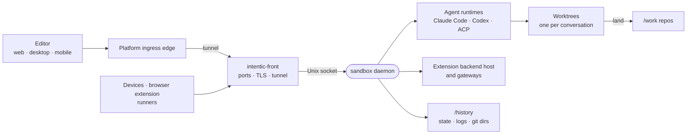

# sandbox

The Node daemon at the center of every sandbox: it runs coding agents in git worktrees, serves the workspace to the editor, and lands their work.


```mermaid
flowchart LR
    editor["Editor<br/>web · desktop · mobile"] --> edge["Platform ingress edge"]
    edge -->|"tunnel"| front["intentic-front<br/>ports · TLS · tunnel"]
    peers["Devices · browser extension<br/>runners"] --> front
    front -->|"Unix socket"| daemon(["sandbox daemon"])
    daemon --> runtimes["Agent runtimes<br/>Claude Code · Codex · ACP"]
    runtimes --> worktrees["Worktrees<br/>one per conversation"]
    worktrees -->|"land"| work["/work repos"]
    daemon --> ext["Extension backend host<br/>and gateways"]
    daemon --> history["/history<br/>state · logs · git dirs"]
```

- It runs as the child of `intentic-front` ([../front](../front)), which owns every port, the TLS certificate and
  the platform tunnel, and relays HTTP over a Unix socket. The daemon decides, the front binds.
- Two roots: `/work` is what agents edit; `/history` is the daemon's own (git dirs, worktrees, the conversation
  database, snapshots, logs) and sits outside `/work`.
- Routes are declared in `@intentic/sandbox-contract`, implemented in `*.routes.ts` and assembled in `src/router.ts`.
  `/events` pushes file, git and fleet changes to the browser.
- One turn: `agent/run/turn/turn-admission.ts` admits it, `turn-plan.ts` picks a runtime, it runs in the
  conversation's worktree (or the main tree, or a remote runner), and `conversations/land/land.ts` lands the result as
  uncommitted changes. Nothing checks the turn when it ends or its work after it lands: the dependency reconciler
  (`workspace/deps/reconcile-deps.ts`) installs when a land moved a manifest or brought a new project, and CI checks
  what the owner pushes. An agent may install inside its turn: an isolated one into its own copy, a main-tree one in
  the install lane. The command gate every runtime consults decides it (`guard/command-guard.ts`,
  `agent/providers/project-installs.ts`), from what `agent/run/turn/turn-safety.ts` set on the turn.
  When main's CI fails, `ci/main-fixer.ts` gives the failing streak one fix agent and sends it every later failure.
- Archive is sticky: only a person's message un-archives a conversation. A turn the daemon starts itself (a retry,
  a nudge, an automation's thread) is refused on an archived one (`conversations/actor/conversation-decide.ts`), and a
  thread whose conversation was archived opens a fresh one instead.
- An isolated turn's runtime runs in the conversation's mount namespace, where `/work` is its worktree
  (`conversations/worktrees/isolation.ts`). Cursor's SDK agent, which ran inside the daemon, moves for such a turn into
  a runtime process born there (`runtimes/cursor/cursor-host.ts`, `cursor-agent-runtime.ts`); its custom tools, hook
  gate and frames stay in the daemon, reached over the process's IPC channel.
- Extension code never runs in the daemon process; it runs in a supervised backend host and in declared processes.
  Both reach the daemon on one token per extension, held to its manifest's `permissions.daemon` (`auth/grants.ts`).
  The panel token that repo operator panels hold reaches no route that returns a stored secret. A listener provider
  belongs to one extension (`extensions/listener/listener-state.ts`: the declarer owning the provider's card, else the first
  installed); a second declaration is refused at load and named on its Extensions row, and the listener routes answer
  the owner alone.
- Every MCP server the daemon hosts for a turn (its browser routers, the machines and browsers it was granted, its
  extension cards' endpoints) is a mount at one door, `ALL /mcp/<name>` (`agent/tools/turn-mounts.ts`). Each
  turn holds a bearer of its own, leased the names it mounted and forgotten when the turn ends, and the door refuses
  any name that turn's lease does not hold, so two turns of one conversation running at once never reach each other's
  mounts. An ACP agent's warm session keeps the MCP config it was opened with, so its turns share the conversation's
  bearer, one live turn at a time, and between turns it reaches nothing. OpenCode (Grok, Gemini) keeps MCP servers per
  directory, not per session, on the one `opencode serve` every conversation shares, so a turn mounts its servers there
  under its conversation's own names and each prompt shows its session those and hides every other conversation's
  (`runtimes/opencode/opencode-mcp.ts`). (2026-09-29: rejected the spawn config, which is fixed at boot and cannot carry
  a turn's bearer, and per-turn names, which change the tool list every turn and throw away the provider's prompt
  cache.) An extension's card-less tool server and its
  agent plugin reach a turn only when the persona's `extensions` list grants that extension (absent: every one). `agent/tools/turn-tools.ts` composes these mounts
  with the mcp-kind cards into one `remote` list, which every runtime projects the same way. An extension's tools are
  answered by the backend host from `api.tools.serve` on a route of its own (`extensions/backend/backend-tools.ts`),
  handed the card's settings by the door; `/x/*` refuses a backend's own MCP path, so tools are reached only through
  the door. The contribution inventory is built once and kept until an extension, the enablement file or the
  capability manifest changes (`capabilities/contributions.ts`).
- A process the daemon starts is put in a workload class by whoever starts it (`workload/workload-class.ts`,
  `spawnAs`): its niceness, IO class and rank for the kernel's OOM killer, inherited by everything it forks. Builds
  go first, agent runtimes last, children before their parents. Nothing ranks a process by its command line.
- A heavy program (a build, a test run, a typecheck) is recognised by what it is as it starts, not by the words of
  the line that started it: the daemon hands every agent command the table (`system/resources/heavy-commands.ts`,
  the shared rules in `@intentic/constants/heavy-rules`), and the program queues itself through `bin/queue-run`.
  Agent commands reach their pane by file (`bin/tmux-run -f`), so no command line carries their words.
- One `ResourceBudget` (`workload/resource-budget.ts`) decides whether there is room for more work: the turn door, a
  child waiting for room, heavy commands (over the local `room.sock`) and the editor's memory gauge all read its one
  snapshot, taken by the formula in `@intentic/constants/memory-room`.
- Stored files evolve under one engine (`store/`). Each is declared with `defineDocument` beside its store, carrying
  the conversions its shape has had, its path (the contract's state-file tables are found from it, `stateFile`) and
  its layout; a store opens it with `store/open-document.ts` (`openDocument`, `openEntries`, `openIdList`,
  `openDirectory`), which parses with the document's own schema through the contract's one `readDocument`, runs its
  conversions on every read and keeps what this build does not know on writes, so a store's next save is what
  persists a converted shape. Families of files with one shape (the doors' enrollment and burn files, the two vaults,
  the two install ledgers) are one spec factory each. A runtime's regrowable cache is the only file opened without a
  document (`cacheFile`); `store/documents-coverage.test.ts` fails on any other. Before any store opens, `store/evolution/state-convergence.ts` does only what a read
  cannot (documents that moved, structural steps: a regroup, a database schema, an import) under a journal a
  rolled-back build undoes, committed once boot converges; it runs each document's conversions without writing, so one
  that would fail is named first. A step or write that throws partway is put back at once, `/health` reports the
  journal `failed` for the rest of that boot (a host takes it as the update not having taken), and the stores go on
  converting on read; nothing of that boot commits. `src/state-plan.ts` is the same plan, read-only, for `ic`'s pre-flight. Both
  take every document and structural step from `bootstrap/state-registry.ts` (`main.ts` hands it to the boot step),
  never from what a process loaded; it sits in the boot wiring, above every subsystem, because it imports them all.
  `store/shapes/write-state-shapes.ts --freeze` (which the fixers run in a worktree before its land, when the change
  reached a daemon or contract source: `conversations/land/worktree-fixers.ts`) writes it from every
  `export const name = defineDocument(…)` (or `defineStep`) in the source, failing on a definition in any other form,
  and records each document's shape in `store/generated/state-shapes.json` by the release that first shipped it.
  `--checks` (this package's `pretypecheck`) derives the uncommitted `state-shapes.ts` from it: every released shape
  must still fit today's schema after its conversions and lose no key without a `drop` or `rename`
  (`store/evolution/conversion-types.ts`).
- A rollback is decided by release: `.intentic/local/newest-run.json` names the newest version that booted all the way
  here (a build stamps it when it commits, never before), and a build older than it reports a downgrade and keeps its
  hands off what it cannot read. A build whose boot failed leaves no stamp, so the version a host puts back is no
  downgrade. The digest of a build's
  conversions (every conversion's description, earlier address and step id) identifies its journal episode: only a
  build with the same digest resumes one, and any other open episode is put back. The conversion count earlier builds
  compared is still written for them, and decides nothing.
- A `rename` conversion moves a key and nothing more: there is no grace window writing both names. A build rolled back
  past a committed rename keeps the new name as a key it does not know, and reads its own default for the old one.
- A boot that fails before the readiness gate writes why to `/history/boot-failure.json` (`system/boot/boot-failure.ts`:
  when, this build's version, the error with the first lines of its stack, the step) and exits 1, so the front starts
  it again with backoff instead of a daemon that answers `/health` and never serves; `ic` reads the file, and the next
  boot that reaches the gate removes it. `INTENTIC_FAULT` is the nightly update drill's hook for exercising that and the
  host's rollback (`system/boot/fault.ts`): `crash-at-boot` fails the boot before convergence, `crash-after-ready` exits 1
  twenty seconds after the gate opens, `fail-conversion` makes convergence throw with an episode open. Production images
  never set it; any other value is ignored.
- `conversations.db` never keeps the daemon down (`store/conversations-db-recovery.ts`): after a run that died
  unannounced it is quick-checked before anything reads it, and a file that fails to open or to pass is moved aside with
  its sidecars as `conversations.db.corrupt-<ms>` (never deleted), what still reads of it is copied into a new file with
  `VACUUM INTO`, or an empty one is made, and the owner's settings-problems card names the whole file. One missing while
  conversation directories remain is made again empty the same way.
- The boot's orphan sweep (`store/conversation-units.ts`) moves a conversation directory no database row owns to
  `/history/trash/conversations/` rather than deleting it, and removes it 14 days later; the blob sweep counts the
  records there as names still standing. It moves nothing on a boot whose database was made again, or while the
  database holds no conversation but directories remain: a lost database is not a fleet of orphans.

- `agent/` runs one turn: its prompt, tools, provider seam and the pipeline in `agent/run/stream-agent.ts`.
  `conversations/` is what turns belong to: the actors, the registry, each conversation's worktree and its land.
  `system/` is this container and its link to the platform: boot, resources and memory admission, TLS, listeners and
  the platform client. `sandboxes/` creates other sandboxes on the owner's account; `hosts/` holds the owner's own
  computers, desktop sync included.
- Each subsystem declares its part of `Services` beside its code (`auth/auth-slice.ts`,
  `conversations/conversations-slice.ts`, …) with the builder that makes it from typed dependencies
  (`createConversationsSlice`, `createGitSlice`, …); `composition.ts` calls the builders in dependency order, so a new
  service in a slice is written in that slice's file. Members that would close an import cycle there are built in
  composition, named by the builder's `Omit`.
- The privacy shield (`privacy/`, off unless the owner turns it on) keeps personal data from model providers the
  owner does not trust. Every runtime whose model requests go to a base URL the daemon names (the Claude Code loop for
  every provider, Codex, OpenCode's Grok and Gemini) is pointed at one gateway route, `ALL /privacy/gateway/<session>/*`,
  whose signed session names the provider and the only upstream it forwards to (`privacy/gateway/`). For an untrusted
  provider it replaces what the detectors (`privacy/detect/`), the vault of known values and, with the `privacy` image
  pack, a local name model find with tokens like `⟦PERSON_3⟧`, and restores them in the answer as it streams back, so
  the agent's tools run on real values while the provider reads tokens; images and PDFs go as masked text or are
  withheld. The vault (`privacy/privacy-vault.ts`) keeps one token per value for the whole workspace, beside the
  credentials, so a resumed or handed-off transcript masks to the same bytes. A runtime the gateway cannot stand in
  front of (Cursor, ACP agents, Pi) is refused on an untrusted provider (`privacy-unshielded`), helper jobs step over
  such a rung, children stay off runners, and a native push or a public share carries the kind of data instead of the
  data. The policy lives off the workspace and only the owner changes it; the agent's `privacy` CLI can only teach
  it a dataset's values.

More: [subsystems](docs/subsystems.md) (how the parts connect), [environment](docs/env-contract.md) (what the daemon
reads at start), [debugging](docs/debugging.md) (logs, diagnostics, state on disk).

## Key files

- [src/main.ts](src/main.ts) — the entry point: boot phases in the one order that matters.
- [src/composition.ts](src/composition.ts) — `Services` extends each module's own slice; `createServices` builds every subsystem once, `wireReactions` subscribes them to each other.
- [src/app.ts](src/app.ts) — the Hono app: security headers, boot gate, CORS, auth, raw routes, then the oRPC handler.
- [src/router.ts](src/router.ts) — the per-domain route factories assembled into the contract's shape.
- [src/env.config.ts](src/env.config.ts) — the configuration schema read from the environment.
- [src/agent/run/stream-agent.ts](src/agent/run/stream-agent.ts) — `streamAgent`: one turn, from placement to settlement.

## Layout

Main groups under `src/`:

| Concern | Directories |
| --- | --- |
| Turns and agents | `agent/` `conversations/` `runtimes/` `sessions/` `personas/` `loops/` `workflows/` `guard/` `rules/` |
| Workspace | `workspace/` `git/` `history/` `derived/` `terminal/` `processes/` `ports/` `panels/` |
| Owner controls | `auth/` `secrets/` `needs/` `areas/` `approvals/` `safety/` `privacy/` `usage/` `wallet/` `settings/` |
| Outside world | `capabilities/` `extensions/` `browser/` `hosts/` `peers/` `webext/` `runners/` `sandboxes/` `ci/` `automations/` |
| Network | `front/` `tunnel/` `vpn/` `exit/` `netdisk/` `public/` `share/` `webchat/` |
| Plumbing | `bootstrap/` `store/` `seams/` `system/` `http/` `logs/` `invariants/` `workload/` |
| Test support | `harness/` `fences/` `e2e/` |

A slice's test fake sits beside its slice as `<slice>.testing.ts` (for example `auth/auth-slice.testing.ts`), along with the in-memory stores it holds. `harness/route-services.testing.ts` spreads those fakes into one `Services`, so a new service gets its fake in the slice it joins.

## Commands

```sh
pnpm --filter @intentic/sandbox test         # unit and integration suites
pnpm dev:sandbox                             # repo root: watch loop that rebuilds or restarts a dev sandbox
sh _sandbox/sandbox/scripts/dev-restart.sh   # recompile and restart the daemon inside a dev container
```
