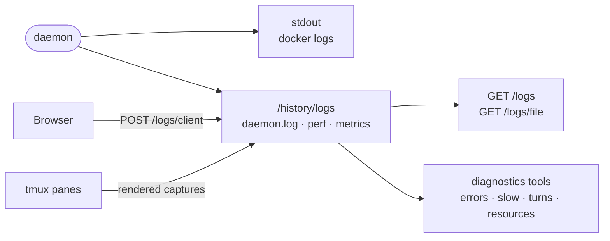

# Debugging the daemon

Where to look when a running daemon misbehaves: its health probe, the log files it keeps on `/history`, the diagnostics tools its agents get, and the state it leaves on disk.

## First checks

- Inside the container, `curl -s localhost:8787/health` answers even mid-boot. `boot` lists every boot step with its
  state and time, `announce` says whether the platform was reached, and `reach` / `reachedBy` say how the world gets in.
- On the host, `ic sandbox doctor` walks the sandbox's reachability chain and names the broken link.
- `docker logs` shows the daemon's JSON lines and `intentic-front`'s own log (its level from `FRONT_LOG`). A daemon
  that refuses its config says why on stderr and exits with code 78.

## Log files

Everything lives under `/history/logs`, outside the agents' `/work`; [src/logs/log-files.ts](../src/logs/log-files.ts)
owns the layout and prunes by size, age and count.

| File | What it records |
| --- | --- |
| `daemon.log` | The daemon's pino lines; `ctx.conversationId` and `ctx.requestId` tie a line to a turn or a browser request |
| `perf.jsonl` | Timing spans, including every HTTP request |
| `client.jsonl` | Errors, stalls and recoveries browsers reported |
| `resource-metrics.jsonl` | One sample a minute: memory, CPU, event-loop delay, heaviest processes |
| `filter-stats.jsonl` | One row per agent shell command through the output filter |
| `terminals/`, `services/`, `intentic-runs/` | tmux pane captures, supervised service processes, `intentic` CLI runs |
| `daemon-exit.json` | Whether the previous run exited cleanly or was killed |

Node's fatal-error reports (`report.*.json`) land in the same directory. `LOG_LEVEL` sets the level; `LOG_PRETTY=1`
pretty-prints to stdout instead of writing `daemon.log`.

## Reading them

- `GET /logs` lists the files and `GET /logs/file?name=…` returns a line-aligned tail window; both need the maintainer
  role.
- Agents get a read-only `diagnostics` MCP server ([src/logs/diagnostics-tools.ts](../src/logs/diagnostics-tools.ts))
  with `errors`, `slow`, `turns` and `resources` over the same files and the spend ledger.
- Invariant violations and event-loop stalls (`platform/resources/loop-watchdog.ts`) are written to `daemon.log`.

## State on disk

- `/history`: `conversations.db` (the conversation registry), `conversations/` (one directory per conversation),
  `worktrees/`, `gits/` (every repository's git dir), `scopes/` (workspace history snapshots), `engines/`.
- `/work/.intentic`: `config/` (settings, capabilities, automations, safety policy), `records/` and `secrets/`. The
  table of which file backs which view is `state/workspace-state.ts` in `@intentic/sandbox-contract`.
