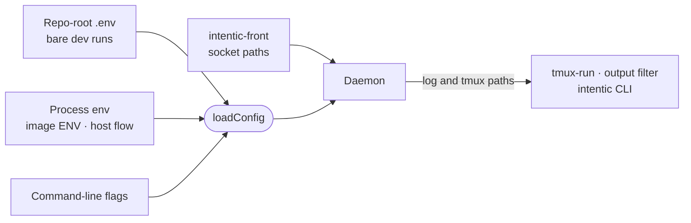

# Environment contract

What the daemon reads from its environment at start, where each value comes from, and which file defines it.

## The schema

[src/env.config.ts](../src/env.config.ts) is the contract: one zod schema with a comment on every field. A variable's
name is its schema path in SCREAMING_SNAKE per segment, so `google.clientId` is `GOOGLE_CLIENT_ID` and
`sandbox.publicUrl` is `SANDBOX_PUBLIC_URL`. Sources apply in order, later wins: the monorepo-root `.env` (found only
when the daemon runs from a checkout), the process environment, then command-line flags. Fields marked
`meta({ secret: true })` hold credentials.

| Group | For example |
| --- | --- |
| Roots | `WORKSPACE_ROOT`, `HISTORY_ROOT`, `AGENT_AUTH_DIR` |
| Owner and sign-in | `CONNECT_TOKEN`, `OWNER_EMAIL`, `GOOGLE_CLIENT_ID`, `WEB_ORIGIN` |
| Reachability | `SANDBOX_GRANT`, `INGRESS_URL`, `SANDBOX_PUBLIC_URL`, `PLATFORM_URL`, `SANDBOX_PORT` |
| Posture | `SANDBOX_PROFILE`, `SANDBOX_VM`, `SANDBOX_PREWARM`, `IDLE_STOP_MINUTES` |
| Image assets | `IQ_MODEL_DIR`, `WEBQ_PLUGIN_DIR`, `EXTENSIONS_DIR`, `TRANSLATOR_URL` |
| Setup pairings | `SYNC_PAIR_TOKEN`, `HOST_PAIR_TOKEN` |

## Who sets what

- The image bakes the asset paths and ports ([Dockerfile](../Dockerfile) `ENV` lines).
- The host's creation flow sets identity, reachability and the owner's resource asks. `REPLAY_ENV` in
  [`@intentic/sandbox-run`](../../../_shared/sandbox-run/src/index.ts) lists every variable a recreate carries over.
- `intentic-front` sets `INTENTIC_FRONT_SOCKET` and `INTENTIC_NODE_SOCKET` for the daemon it spawns, both named once
  in the front's `front-wire` crate and read by [src/bootstrap/front-door.ts](../src/bootstrap/front-door.ts).
- A runner container gets `RUNNER_PARENT_URL` and `RUNNER_PAIR_TOKEN`, both or neither
  ([src/runners/runner-mode.ts](../src/runners/runner-mode.ts)).
- The daemon sets `INTENTIC_LOG_DIR`, `INTENTIC_TERMINAL_LOGS_DIR` and `INTENTIC_AGENT_TMUX` for its own children
  ([src/bootstrap/daemon-env.ts](../src/bootstrap/daemon-env.ts)).

## Refusals

The daemon exits with code 78 rather than serve an unsafe posture:

- reachable (`CONNECT_TOKEN` or `SANDBOX_PUBLIC_URL` set) with an empty `GOOGLE_CLIENT_ID`, since nobody would be
  authenticated; only the e2e harnesses bypass this, with `SANDBOX_ALLOW_UNAUTHENTICATED`;
- `SANDBOX_PROFILE=local` with a non-loopback `SANDBOX_HOST`, a connect token, a public URL or a platform URL
  (`requireLocalContract` in [src/system/boot/profile.ts](../src/system/boot/profile.ts));
- started without the two front sockets.
