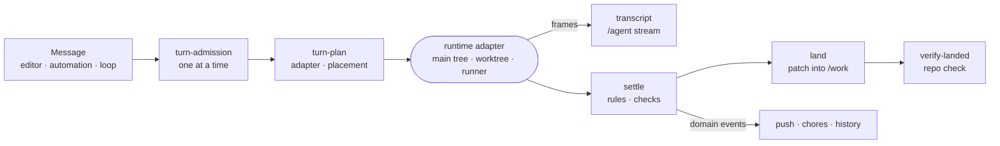

# Subsystems

How the daemon's parts are built, started and connected: one composition root, a phased boot, a contract-first HTTP surface and in-process seams between subsystems.

## Composition

`createServices` in [src/composition.ts](../src/composition.ts) builds `Services` once from the config. Each provider
adds its own slice to the interface. A module takes `Pick<Services, …>` of the seams it uses, so its dependencies are
visible in its signature. `wireReactions` in the same file subscribes the reacting subsystems to the domain events.

## Boot

[src/main.ts](../src/main.ts) runs the phases in [src/bootstrap/](../src/bootstrap): the front door first, so
`/health` and `/events` answer at once; then the boot chain (`boot-chain.ts`) while data routes wait behind the
readiness gate; then workspace apps, sweeps, restores, schedulers, resumes, version watches and change reactions.
Every subsystem registers its own teardown in one `DisposableStore`, so shutdown enumerates nothing.

## HTTP

Routes are declared in `@intentic/sandbox-contract`, each with a policy (auth floor, stream, boot gating).
[src/app.ts](../src/app.ts) wraps every request in order: security headers, compression, request timing, the boot gate, CORS,
then authentication (the owner's session, the grant table, the role floor). Raw routes register through
`http/raw-route-server.ts` under their `RAW_ROUTES` declaration, so none exists without a policy. The oRPC handler for
[src/router.ts](../src/router.ts) answers everything else.

## Seams

Subsystems that react to each other never import each other:

- `seams/domain-events.ts` carries `workspace`, `run.settled`, `turn.awaiting`, `turn.finished` and `tree.changed`.
  Publishers name the event; `wireReactions` sends them to chore automations, push notifications, history snapshots
  and the conversation queue.
- `seams/runtime-feed.ts` announces tmux sessions, panels, browsers and child turns to `system/runtime-watch.ts`,
  which pushes them over `/events` beside the file watcher and the git ref watcher.
- `seams/turn-starter.ts` is how automations, loops, approvals, CI fixes, subagents and runners start or drive a turn;
  composition hands them `agent/run/turn/turn-doors.ts`.

## Peers

`peers/` gives every outside party one door shape: a short-lived pairing, a durable enrollment token, a socket and an
MCP bridge. The owner's computers (`hosts/`), the browser extension (`webext/`) and runners (`runners/`) are its three
users.

## Invariants

Each subsystem keeps its self-checks in an `invariant.ts`, registered in `invariants/register.ts`. Checks run at
`boot`, after a turn settles, and on a standing sweep. A violation is logged; it never throws into the daemon.
