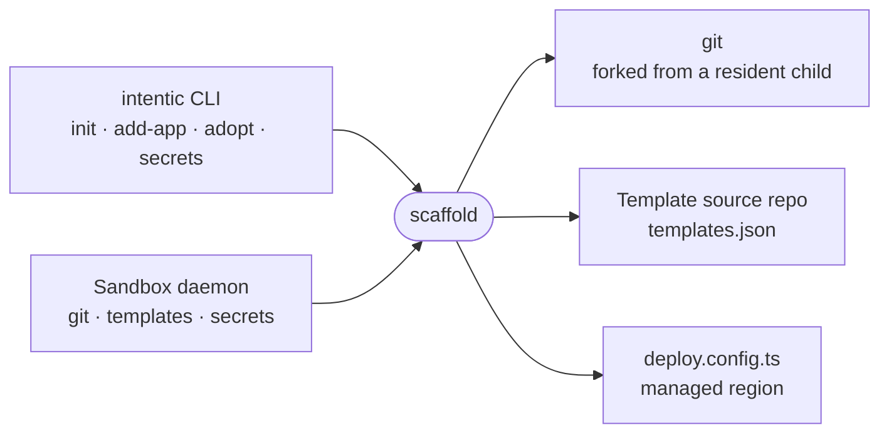

# scaffold

The workspace plumbing the intentic CLI and the sandbox daemon share: running git, the on-disk layout, template scaffolding, the `deploy.config.ts` managed region and secret sync state.



- `defaultGit` is the `GitRunner` behind almost every git call the daemon makes. It forks git from a small resident
  child (`forker.ts`) rather than from the large daemon process, retries only on `index.lock` contention, and
  marks pathspecs literal so a file named `[slug]` matches only itself. `forkedExec` runs the daemon's other polled
  commands (tmux, status probes) from the same child: a spawn from a large process first copies its page tables, 52 ms
  at 778 MB, where a request to the child costs 0.04 ms. `politeGit` runs bulk agent work under `nice` and `ionice`.
- `workspace-layout.ts` names the three repos a project operates on (`intent`, `desired-state`, `app`) and their
  well-known files. The CLI and the daemon must agree on these names.
- `scaffoldMonorepo` and `addAppsToMonorepo` build an app monorepo from a template source repository described by
  its `templates.json`; `DEFAULT_TEMPLATE_SOURCE` is the default, and a workspace overrides it in
  `.intentic/config/templates.json`.
- `writeManagedRegion` and `readManagedRegion` regenerate only the platform-owned block between the markers in
  `deploy.config.ts`; user code outside it is untouched. A line inside the region the parser cannot read makes the
  next write refuse and name that line, since regenerating the region would delete it.
- `secret-inventory.ts` keeps sha256 digests of the secrets last pushed to CI, the only way to tell current from
  stale since CI cannot read them back.

## Key files

- [src/exec.ts](src/exec.ts) — `defaultGit`, `politeGit`, `forkedExec`, the forker client and git command observation.
- [src/git.ts](src/git.ts) — generic git verbs over an injectable `GitRunner`.
- [src/workspace-layout.ts](src/workspace-layout.ts) — the repo roles, directory names and file names.
- [src/inject-template.ts](src/inject-template.ts) — template fetch, monorepo shell and app injection.
- [src/deploy-config.ts](src/deploy-config.ts) — render and parse of the `deploy.config.ts` managed region.
- [src/index.ts](src/index.ts) — the single export surface.

## Commands

```sh
pnpm --filter @intentic/scaffold test
```
