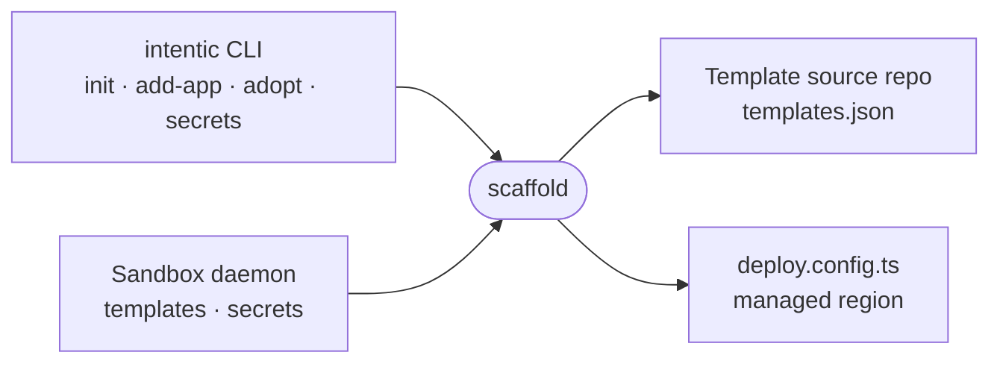

# scaffold

The workspace skeleton the intentic CLI and the sandbox daemon share: the on-disk layout, template scaffolding, the `deploy.config.ts` managed region and secret sync state.


```mermaid
flowchart LR
    cli["intentic CLI<br/>init · add-app · adopt · secrets"] --> scaffold(["scaffold"])
    daemon["Sandbox daemon<br/>templates · secrets"] --> scaffold
    scaffold --> source["Template source repo<br/>templates.json"]
    scaffold --> config["deploy.config.ts<br/>managed region"]
```

- Running git is not here: the runner (`defaultGit`, `forkedExec`, the git verbs and stale-lock clearing) is
  [`@intentic/base/git`](../../_tools/base/src/git/index.ts). (2026-10-06: it moved there from this package, which is
  named for the skeleton, rather than into a package of its own, since a name npm has never seen fails the release plan
  until it is registered by hand.)
- `workspace-layout.ts` names the three repos a project operates on (`intent`, `desired-state`, `app`) and their
  well-known files. The CLI and the daemon must agree on these names.
- `scaffoldMonorepo` and `addAppsToMonorepo` build an app monorepo from a template source repository described by
  its `templates.json`; `DEFAULT_TEMPLATE_SOURCE` is the default, and a workspace overrides it in
  `.intentic/config/templates.json`.
- `writeManagedRegion` and `readManagedRegion` regenerate only the platform-owned block between the markers in
  `deploy.config.ts`; user code outside it is untouched. A line inside the region the parser cannot read makes the
  next write refuse and name that line, since regenerating the region would delete it.
- `secret-inventory.ts` keeps sha256 digests of the secrets last pushed to CI, the only way to tell current from
  stale since CI cannot read them back.

## Key files

- [src/workspace-layout.ts](src/workspace-layout.ts) — the repo roles, directory names and file names.
- [src/inject-template.ts](src/inject-template.ts) — template fetch, monorepo shell and app injection.
- [src/deploy-config.ts](src/deploy-config.ts) — render and parse of the `deploy.config.ts` managed region.
- [src/index.ts](src/index.ts) — the single export surface.

## Commands

```sh
pnpm --filter @intentic/scaffold test
```
