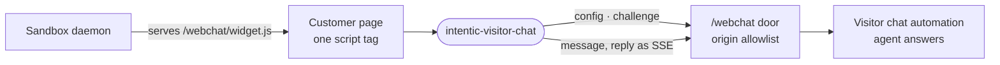

# webchat-widget

The Visitor chat widget: one script a website loads so its visitors can talk to a sandbox agent in a floating chat panel.



- Runs in a visitor's browser on the customer's site. The build is a single IIFE file (`vite.config.ts`) that finds
  its own `<script data-automation>` tag, fetches the chat's config and mounts `<intentic-visitor-chat>`. A sleeping
  sandbox or a disallowed origin renders nothing.
- The launcher and panel live in a shadow root so the host's CSS and the widget's never mix. Google sign-in and
  Cloudflare Turnstile are the exception: third-party iframes need the light DOM, projected through a `<slot>`.
- A visitor is a thread id kept in `localStorage` per automation, or a Google ID token the daemon verifies. A typed
  name is display only. The first message of a thread spends a proof-of-work or Turnstile challenge.
- Replies stream back as SSE over a `POST`. Answers written later (an approval-gated reply, a human writing as the
  agent) arrive by polling, which backs off while the sandbox is unreachable.
- The daemon serves the built file itself (`_sandbox/sandbox/src/webchat/`), so the widget and its routes always ship
  together. Build this package before the daemon can serve it.

## Key files

- [src/main.ts](src/main.ts) — embed entry: find the script tag, fetch config, mount the element.
- [src/element.ts](src/element.ts) — `VisitorChatElement`: launcher, panel, sending and reply polling.
- [src/transport.ts](src/transport.ts) — the `/webchat` calls and the SSE reader.
- [src/identity.ts](src/identity.ts) — thread ids, display names and Google sign-in, per automation.
- [src/challenge.ts](src/challenge.ts) — the Turnstile bot check.

## Commands

```sh
pnpm --filter @intentic/webchat-widget build
pnpm --filter @intentic/webchat-widget test
```
