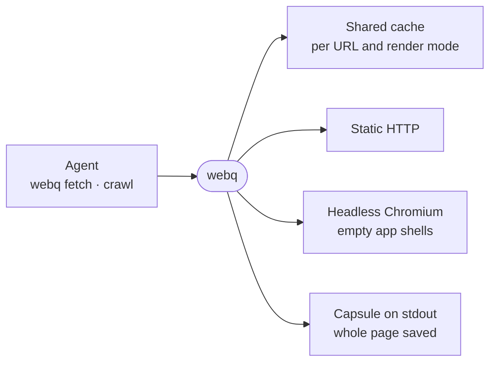

# webq

A CLI that fetches web pages for an agent as pruned, token-budgeted markdown and crawls a site into files, over one shared cache.



- A raw page is mostly navigation and script, and one docs page can fill a context window. `webq fetch` prints a
  capsule (title, final URL, token cost, cache, network or browser), then the page with its chrome pruned and clipped
  to `--budget`, and saves the whole page as markdown with front matter.
- `--query` keeps only the blocks relevant to a question (BM25). On a crawl it also visits matching links first.
- When the static HTML is an empty app shell, the page renders in the image's Chromium if that feature pack is
  installed; without it webq says so and serves the static HTML.
- Crawls stay on the start origin, obey `robots.txt` and report every skipped URL by reason, so a capped crawl never
  reads as complete.
- The sandbox image puts `webq` on PATH and loads [plugin/skills/webq/SKILL.md](plugin/skills/webq/SKILL.md), which
  tells agents when to use it over WebFetch. It does not handle pages behind a sign-in. [fileq](../fileq) reuses the
  `./dom` and `./markdown` exports for HTML-based documents.

## Usage

```sh
webq fetch https://docs.example.com/guide --query "rate limits"
webq crawl https://docs.example.com --max-pages 30
```

## Key files

- [src/app.ts](src/app.ts) — the commands and the `--help` text an agent reads.
- [src/lib/page.ts](src/lib/page.ts) — one URL to one `PageResult`: cache, static fetch, browser fallback, notes.
- [src/lib/prune.ts](src/lib/prune.ts) — scores elements and drops navigation and page chrome.
- [src/lib/markdown.ts](src/lib/markdown.ts) — DOM to markdown with absolute links.
- [src/lib/crawl.ts](src/lib/crawl.ts) — bounded crawl, breadth-first or query-steered, with skip counts.
- [src/cli.integration.test.ts](src/cli.integration.test.ts) — the CLI end to end against a loopback fixture site.

## Commands

```sh
pnpm --filter @intentic/webq test
```
