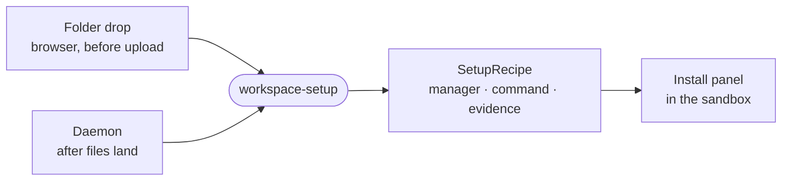

# workspace-setup

Decides which dependency manager and install command a project needs from its manifest and lockfile names, for both the browser upload and the sandbox daemon.



- A dropped project arrives without `node_modules` or `.venv`, which are built for the wrong platform and slow to
  upload. Naming the manager lets the sandbox run the install itself.
- Pure and browser-safe: it reads file names and an already-parsed `packageManager` field, never the disk. The web
  app calls `detectProjects` before upload
  ([useUploadQueue.ts](../../_editor/web/src/features/workspace/files/upload/useUploadQueue.ts)); the daemon calls
  `recipeFor`, checks the `marker` directory and that `manager` is on PATH
  ([workspace-setup.ts](../sandbox/src/workspace/layout/workspace-setup.ts)).
- Node and Python only, because their managers are baked into the sandbox image. A `packageManager` field beats any
  lockfile, and a Node project with no lockfile falls back to `npm`.
- The shallowest manifest on each branch wins, so a monorepo installs once from its root.

## Key files

- [src/index.ts](src/index.ts) — `recipeFor`, `detectProjects`, `managerFromPackageJson` and the lockfile tables.
- [src/index.test.ts](src/index.test.ts) — which files pick which manager, by example.
- [package.json](package.json) — the single export, with no Node imports behind it.

## Commands

```sh
pnpm --filter @intentic/workspace-setup test
```
