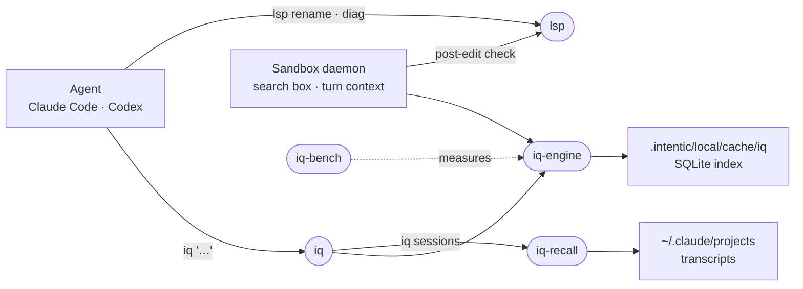

# Search

The tools an agent uses to find the right code instead of reading everything: ranked workspace search, recall of past sessions, and compiler-backed rename and diagnostics.

| Package | Role |
| --- | --- |
| [iq](iq) | The `iq` CLI and the Claude Code plugin that teaches agents to use it. |
| [iq-engine](iq-engine) | Index, retrieval engines, rank fusion and the token-budgeted renderer. |
| [iq-recall](iq-recall) | Indexes past session transcripts for topic-to-file recall and forking. |
| [lsp](lsp) | The `lsp` CLI: TypeScript rename and diagnostics over the native compiler. |
| [iq-bench](iq-bench) | Benchmarks retrieval configs and paired agent runs with and without iq. |

All of it runs inside the sandbox: the CLIs are on `PATH`, and the daemon keeps one resident `iq-engine` in a child process for the editor's search box and for the ranked anchors it prepends to each agent turn.
