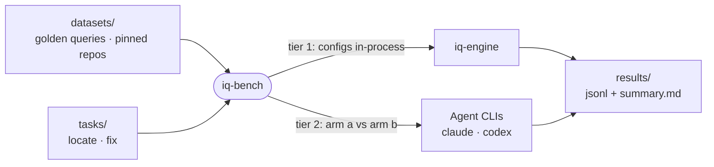

# iq-bench

The benchmark harness for `iq`: it scores retrieval configurations against golden query sets and runs paired agent tasks with and without `iq` to show whether a change helps.



- Tier 1 (`retrieval`) runs every configuration in `CONFIGS` (all stages on, then each stage off) in-process and scores recall@1/5/10, MRR and nDCG against expected anchors. `impact` checks the change-impact predictor against what past commits touched.
- Tier 2 (`agents`) gives the same task to an agent CLI twice: arm `a` gets a baseline instruction file, arm `b` the teaching from [iq](../iq)'s shipped plugin, so only the content differs. Tasks are graded by expected anchors, or by a test command after a bug-introducing patch.
- Tier 2 spends real tokens: it runs only under `IQ_BENCH_AGENTS=1`, which the `bench:agents` script sets, or with `--dry`.
- The corpora are this monorepo plus external repos pinned by commit in `datasets/repos.lock.json`, cloned into `.cache`. Semantic configs need the models, fetched once with iq-engine's script; without them those configs report as skipped.
- Reports compare each configuration with `full` case by case and apply a sign test to the wins and losses.

## Key files

- [src/cli.ts](src/cli.ts) — the `retrieval`, `impact`, `agents` and `analyze` entry points.
- [src/configs.ts](src/configs.ts) — the named pipeline configurations tier 1 compares.
- [src/score.ts](src/score.ts) — how an `iq` answer becomes ranked anchors and scores.
- [src/agents/run.ts](src/agents/run.ts) — tier 2: arms, vendors, spend cap, transcripts.
- [src/schema.ts](src/schema.ts) — the dataset, task and result row formats.

## Commands

```sh
pnpm --filter @intentic/iq-bench build
pnpm --filter @intentic/iq-bench bench:retrieval
pnpm --filter @intentic/iq-bench bench:agents -- --task hono-body-limit --vendor claude
```
