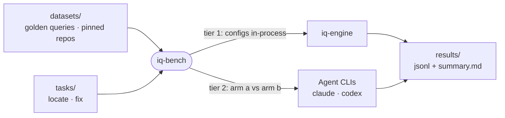

# iq-bench

The benchmark harness for `iq`: it scores retrieval configurations against golden query sets and runs paired agent tasks with and without `iq` to show whether a change helps.


```mermaid
flowchart LR
    datasets["datasets/<br/>golden queries · pinned repos"] --> bench(["iq-bench"])
    tasks["tasks/<br/>locate · fix"] --> bench
    bench -- "tier 1: configs in-process" --> engine["iq-engine"]
    bench -- "tier 2: arm a vs arm b" --> agents["Agent CLIs<br/>claude · codex"]
    engine --> results["results/<br/>jsonl + summary.md"]
    agents --> results
```

- Tier 1 (`retrieval`) runs every configuration in `CONFIGS` (all stages on, then each stage off) in-process and scores recall@1/5/10, MRR and nDCG against expected anchors. `impact` checks the change-impact predictor against what past commits touched.
- Tier 2 (`agents`) gives the same task to an agent CLI twice: arm `a` gets a baseline instruction file, arm `b` the teaching from [iq](../iq)'s shipped plugin, so only the content differs. Tasks are graded by expected anchors, or by a test command after a bug-introducing patch.
- Tier 2 spends real tokens: it runs only under `IQ_BENCH_AGENTS=1`, which the `bench:agents` script sets, or with `--dry`.
- The corpora are this monorepo plus external repos pinned by commit in `datasets/repos.lock.json`, cloned into `.cache`. Semantic configs need the models, fetched once with iq-engine's script; without them those configs report as skipped.
- Reports compare each configuration with `full` case by case and apply a sign test to the wins and losses.
- Cases carry `slices` naming what they test beyond the average: `identifier-in-prose`, `paraphrase`, `near-duplicate`, `deprecated` and `no-answer`, several at once or none (`general`). The report scores every slice on its own, recall@1 · recall@5 per config beside the slice's case count, and flags a slice every config scores 100% on as saturated: it can no longer show a change. SurfSense's retrieval eval (MODSetter/SurfSense, `docs/architecture/search.md`) is the precedent: its same-language slices sat at 100% for every model and weight, so they could not see the regression an embedder swap caused.
- A `no-answer` case has no anchors, because nothing in the corpus answers it. It scores by whether iq called its answer weak, and the "Weak answers" section reads those cases against the answerable ones to calibrate iq-engine's `WEAK_FLOOR`.
- `IQ_BENCH_CACHE` moves the clones and indexes out of `.cache`, so two runs in one checkout never rebuild each other's index or share a vector cache written by another embedder.

## Key files

- [src/cli.ts](src/cli.ts) — the `retrieval`, `impact`, `agents` and `analyze` entry points.
- [src/configs.ts](src/configs.ts) — the named pipeline configurations tier 1 compares.
- [src/score.ts](src/score.ts) — how an `iq` answer becomes ranked anchors and scores.
- [src/slices.ts](src/slices.ts) — the per-slice table and the weak-floor calibration.
- [src/agents/run.ts](src/agents/run.ts) — tier 2: arms, vendors, spend cap, transcripts.
- [src/schema.ts](src/schema.ts) — the dataset, task and result row formats, and what each slice means.

## Commands

```sh
pnpm --filter @intentic/iq-bench build
pnpm --filter @intentic/iq-bench bench:retrieval
pnpm --filter @intentic/iq-bench bench:agents -- --task hono-body-limit --vendor claude
```

## The weak floor

iq calls an answer `weak` when no passage the cross-encoder reranked reaches `WEAK_FLOOR` ([iq-engine's dispatch](../iq-engine/src/verbs/dispatch.ts)).

- 2026-09-29: `WEAK_FLOOR` is 0.005. Over all three corpora it calls 2 of 67 reranked answerable cases weak (3%) and 5 of 12 no-answer cases (42%). One of the two false alarms is a paraphrase iq did not find anyway. Per corpus it holds 1 in 23 on click and hono and 0 in 21 on intentic. 0.02 adds a false alarm and catches nothing more; 0.1 catches 9 of 12 but calls 5 answerable cases weak (7%), 4 of them on click (17%).
- The floor is low because this cross-encoder (ms-marco-MiniLM, trained on web passages) scores some real code answers near zero: the answerable tail runs 0.0001, 0.0007, 0.010, 0.027, 0.055, and no-answer cases whose best passage is a neighbouring feature score high (click's password encryption against `hide_input` 0.90, YAML config against `default_map` 0.87, hono's SMTP 0.46). A reranker trained on code is the change most likely to pull the two populations apart; the calibration table measures it.
- The score is the cross-encoder's alone, so it does not depend on the embedder, but which passages reach the cross-encoder does. The numbers above ran with CLS pooling; a `full` rerun of click and hono under mean pooling classified every case the same at 0.005.
- Rejected: a floor on the semantic cosine. On click, under CLS pooling, the no-answer cases scored 0.74 to 0.79 and the answerable ones 0.70 to 0.86, the overlap SurfSense reports for the same embedder, whose cosine over unrelated text bottoms out near 0.62 (its ADR 0033). The bm25 tag is clamped at 1 for nearly every answer, and the margin and the fused ranks are relative to the best hit by construction.
