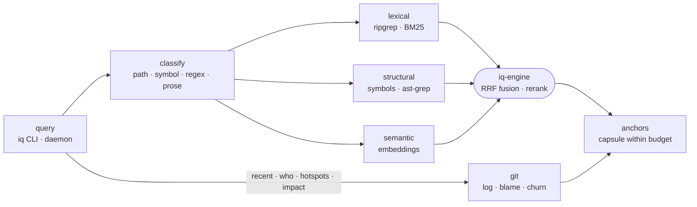

# iq-engine

The search engine behind `iq`: it indexes a workspace into SQLite and answers each query by fusing lexical, structural and semantic signals into ranked, token-budgeted anchors.



- The index is one SQLite database in `.intentic/local/cache/iq`: files, symbols, imports, complexity, chunks with FTS5, and quantized vectors in sqlite-vec. A worker thread writes it; exact verbs (`find`, `refs`) run ripgrep live so they are never stale.
- Prose queries run BM25 plus an RM3-expanded second pass, semantic vectors, reciprocal-rank fusion, then a cross-encoder rerank whose top margin sets `confident` or `ambiguous`. A query that matches nothing exactly escalates to this path.
- The embedder and reranker are ONNX models baked at image build time by `scripts/fetch-model.mjs`. Without them search degrades to BM25 and ripgrep; it never downloads at runtime.
- Every engine's output passes through `floor.ts`: inside any `.intentic` directory only the authored, versioned slice is searchable, and `--ignored` cannot lift that.
- `createEngine` serves one CLI process. `createEngineClient` (`./host`) runs a resident engine in a child process for the daemon, re-indexing on filesystem changes.
- Each retrieval stage is a named entry in `FEATURES`, so [iq-bench](../iq-bench) can switch stages off and compare.

## Key files

- [src/index.ts](src/index.ts) — `createEngine` and `createResidentEngine`.
- [src/verbs/dispatch.ts](src/verbs/dispatch.ts) — the plan each verb runs, including the prose pipeline.
- [src/plan/fuse.ts](src/plan/fuse.ts) — reciprocal-rank fusion, boosts and grouping by file.
- [src/render/text.ts](src/render/text.ts) — the capsule and the body under a hard token budget.
- [src/store/db.ts](src/store/db.ts) — the index schema and its rebuild-on-mismatch version.
- [src/workspace/floor.ts](src/workspace/floor.ts) — what no query can ever surface.

## Commands

```sh
pnpm --filter @intentic/iq-engine test
node scripts/fetch-model.mjs <dest-dir>   # bake the embedder and reranker
```
