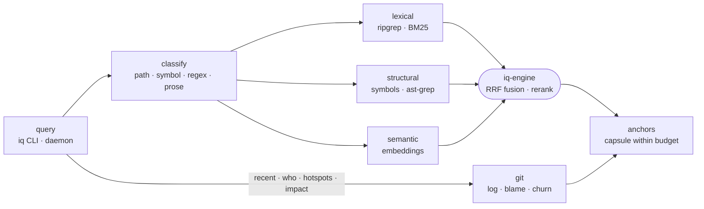

# iq-engine

The search engine behind `iq`: it indexes a workspace into SQLite and answers each query by fusing lexical, structural and semantic signals into ranked, token-budgeted anchors.


```mermaid
flowchart LR
    query["query<br/>iq CLI · daemon"] --> classify["classify<br/>path · symbol · regex · prose"]
    classify --> lexical["lexical<br/>ripgrep · BM25"]
    classify --> structural["structural<br/>symbols · ast-grep"]
    classify --> semantic["semantic<br/>embeddings"]
    lexical --> fuse(["iq-engine<br/>RRF fusion · rerank"])
    structural --> fuse
    semantic --> fuse
    query -- "recent · who · hotspots · impact" --> git["git<br/>log · blame · churn"]
    fuse --> anchors["anchors<br/>capsule within budget"]
    git --> anchors
```

- The index is one SQLite database in `.intentic/local/cache/iq`: files, symbols, imports, complexity, chunks with FTS5, and quantized vectors in sqlite-vec. A worker thread writes it; exact verbs (`find`, `refs`) run ripgrep live so they are never stale.
- Prose queries run BM25 plus an RM3-expanded second pass, semantic vectors, reciprocal-rank fusion, then a cross-encoder rerank whose top margin sets `confident` or `ambiguous`. A query that matches nothing exactly escalates to this path.
- Natural-language answers prefer implementation. A class prior (src 1, config 0.8, tests 0.6, docs 0.5, and 0.3 for generated files: lockfiles, minified bundles, snapshots, `.svg`, `.env` templates) weights fusion and, again, the cross-encoder blend. The cross-encoder is trained on web passages and scores prose that restates a question (docs, changelogs, test names) above the code that answers it, so a prior applied only before it was undone. The `spread` stage lets at most four of one file's best hits into the 32-passage rerank pool, so one file matching on many lines cannot crowd out the files after it.
  - 2026-10-01: tuned on iq-bench's click, hono and intentic queries, then checked on SigMap's corpora (264 queries over 12 repos, from `refs/sigmap`) held out from tuning. Over all 369 answerable queries, MRR@10 rose from 0.520 to 0.605 and hit@1 from 42.5% to 51.2% (90 queries better, 10 worse, sign p≈3e-17); every corpus improved, the held-out ones included. Symbol and lexical verbs are unchanged. Filtering with `--only src` reached a slightly higher hit@5 (75.3% against 72.6%) but a lower hit@1 and MRR, and it hides tests and docs outright, which is why this is a prior and not a filter. On the no-answer slice, `weak` caught 4 of 12 instead of 5, with the same 2 false alarms in 70 answerable queries.
- `weak` overrides both when no reranked passage reaches `WEAK_FLOOR`, a cross-encoder probability, and adds a hint to stop or rephrase once. Every other score in the pipeline is relative to the best hit, so something always leads; this is the one absolute test, calibrated on [iq-bench](../iq-bench)'s no-answer slice. Without a reranker no answer is ever called weak.
- The embedder and reranker are ONNX models baked at image build time by `scripts/fetch-model.mjs`. Without them search degrades to BM25 and ripgrep; it never downloads at runtime.
- Embeddings are bge-small-en-v1.5 (q8): an attention-masked mean over the token states, L2-normalised. Queries carry bge's retrieval instruction ("Represent this sentence for searching relevant passages: "); passages never do. `VECTOR_SPACE` names what a stored vector depends on (model, pooling, normalisation), and both the index and the vector-cache sidecar are keyed by it: changing it empties both stores once and re-embeds every chunk, so vectors from two spaces never mix. The mean config keeps the bare model id as its value, the key existing caches already carry.
  - 2026-09-29: kept mean pooling over bge's reference [CLS] pooling. On iq-bench's 58 natural-language cases (hono, click, intentic), nDCG@10 for mean vs CLS was 0.716 vs 0.699 in the full pipeline (CLS better on 6 cases, worse on 4, sign p 0.75) and 0.610 vs 0.600 for the vector leg alone (12 better, 14 worse). That is a tie, and switching would force every index through a full re-embed (about 80 minutes for this repository's 138k chunks) for no measured gain. Revisit if a larger bench shows a real difference. Dropping the query instruction lowered nDCG under both poolings (vector leg with mean pooling 0.610 to 0.582).
- `verify(text)` is the grounding check behind `iq verify`: it pulls the file paths, `path:line` anchors and code names out of an answer and checks them against the sweep and the index. A missing file or a name defined and written nowhere is an issue with the closest real one suggested; an anchor past its file's end is one; and an anchor whose line cites names the file holds, none of them inside the cited range, its enclosing function, or 15 lines around it, has drifted. Names are matched case-exactly, and a line citing one file at several lines is not judged for drift, since which name belongs to which anchor is a guess there. A file the index has not caught up with is read from disk and its index rows ignored, since an agent verifies right after editing, ahead of the daemon's re-index.
- Every engine's output passes through `floor.ts`: inside any `.intentic` directory only the authored, versioned slice is searchable, and `--ignored` cannot lift that.
- `createEngine` serves one CLI process. `createEngineClient` (`./host`) runs a resident engine in a child process for the daemon, re-indexing on filesystem changes.
- Each retrieval stage is a named entry in `FEATURES`, so [iq-bench](../iq-bench) can switch stages off and compare.

## Key files

- [src/index.ts](src/index.ts) — `createEngine` and `createResidentEngine`.
- [src/verbs/dispatch.ts](src/verbs/dispatch.ts) — the plan each verb runs, including the prose pipeline.
- [src/plan/fuse.ts](src/plan/fuse.ts) — reciprocal-rank fusion, boosts and grouping by file.
- [src/plan/prior.ts](src/plan/prior.ts) — the class prior natural-language answers rank by.
- [src/verify/check.ts](src/verify/check.ts) — what `iq verify` judges, and how it renders.
- [src/render/text.ts](src/render/text.ts) — the capsule and the body under a hard token budget.
- [src/store/db.ts](src/store/db.ts) — the index schema and its rebuild-on-mismatch version.
- [src/workspace/floor.ts](src/workspace/floor.ts) — what no query can ever surface.

## Commands

```sh
pnpm --filter @intentic/iq-engine test
node scripts/fetch-model.mjs <dest-dir>   # bake the embedder and reranker
```
