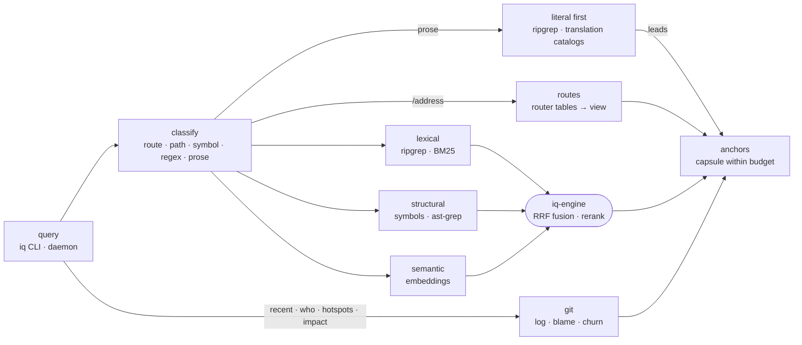

# iq-engine

The search engine behind `iq`: it indexes a workspace into SQLite and answers each query by fusing lexical, structural and semantic signals into ranked, token-budgeted anchors.


```mermaid
flowchart LR
    query["query<br/>iq CLI · daemon"] --> classify["classify<br/>route · path · symbol · regex · prose"]
    classify -- "/address" --> routes["routes<br/>router tables → view"]
    classify -- "prose" --> literal["literal first<br/>ripgrep · translation catalogs"]
    classify --> lexical["lexical<br/>ripgrep · BM25"]
    classify --> structural["structural<br/>symbols · ast-grep"]
    classify --> semantic["semantic<br/>embeddings"]
    lexical --> fuse(["iq-engine<br/>RRF fusion · rerank"])
    structural --> fuse
    semantic --> fuse
    query -- "recent · who · hotspots · impact" --> git["git<br/>log · blame · churn"]
    literal -- "leads" --> anchors["anchors<br/>capsule within budget"]
    routes --> anchors
    fuse --> anchors
    git --> anchors
```

- The index is one SQLite database in `.intentic/local/cache/iq`: files, symbols, imports, complexity, chunks with FTS5, and quantized vectors in sqlite-vec. A worker thread writes it; exact verbs (`find`, `refs`) run ripgrep live so they are never stale.
- Prose queries run BM25 plus an RM3-expanded second pass, semantic vectors, reciprocal-rank fusion, then a cross-encoder rerank. A query that matches nothing exactly escalates to this path. The answer line anchors the passage that put its file first in the blended order, so the `[rerank]` it prints is that file's own score.
- Literal first (`src/verbs/literal.ts`): beside the semantic run, a prose query of three words or more (or two written as copy, sentence-cased or closed like a sentence, or any quoted span) is matched literally, and its hits lead with the semantic answer following. Agents open a third of their sessions on a screenshot and search its text, and a bare query used to read that text as a question (2026-10-06: 0 of 6 random `en.json` strings found). rg looks for the words in order, any whitespace and either apostrophe between them, case-insensitive. Hits in source always lead; hits only in tests or docs lead only for text written as copy, so search words a doc happens to quote do not; more than eight files is common wording and does not lead. A question ("where is…", "how does…") is matched only against whole translation strings: a doc restating it is not its answer.
  - Translation catalogs (`src/engines/catalog.ts`) are any JSON under an `i18n`, `locales`, `lang`, `translations` or `messages` folder. Each is parsed with the line and full dotted key of every string, and UI text is matched against them with case, whitespace and punctuation ignored, interpolation slots (`{name}`, `{{name}}`, `%{name}`, `%s`) standing for whatever the screenshot shows, and vue-i18n's `a | b` plural forms one by one. Part of a string matches when the query is most of it or five words of it. A template vouches only through its own words (two at least, and more than half the query's), or `{count} chat` would fit any sentence ending in "chat".
  - The second hop: a matched key is looked up in code as a quoted string (`t('a.b.c')`, `$t("…")`, `` t(`…`) ``, `keypath="…"`), and its call sites lead the answer, the component before the English catalog line before the other locales. A key with no whole use points at the template it is built from (`` t(`a.b.${kind}`) ``). One `key:` line per matched key says where it sits, how many locales hold it, and where it is used; `iq find` adds the same line when its matches land in a catalog. Equally exact matches (one sentence under three keys) are ordered by where the semantic run ranked their files or folders.
  - Verdict: `confident` for a single key, or a single file writing the text, that the query occurs in as typed; `ambiguous` for several, or for a catalog string the query only contains.
- Routes (`src/verbs/route.ts`, `src/engines/routes.ts`): a query that is an address (`/agents`, `/sandbox/agent?section=tools`) is resolved against the route tables in files that build a router (vue-router, react-router's data routers and flat `<Route>` elements, Angular's `Routes`), found by one rg pass and read by a small scanner that joins nested child paths. The most specific match wins (most literal segments, a catch-all never counts) and loads a view; each parameter and query value is then followed into it: the line that tests for it (`slug === 'agent'`, `case "tools":`, a lookup table) and the component that branch mounts, descending when it mounts one. The answer is the screen the address ends on, then the declaration, the branches and the nav table entry naming the value; `route:` and one `name=value:` line per step say how. An address no route declares falls back to a path search. A test's stub router (`{ path, component: page }`) does not count.
- Siblings (`src/verbs/siblings.ts`): for `q` and `find`, a `siblings:` line names the other source and test files in the answer's folder, those iq ranked first, then those whose name holds a query word, six at most. Mined 2026-10-06: the first query of a session named the file the session went on to edit 20% of the time, but its folder 58%. Replayed over 361 transcript queries, when a session edited a neighbour of iq's answer the line named it 56 times in 76.
- The verdict (`src/verbs/verdict.ts`) is `confident` only when the top file's best passage scores at least `CONFIDENT_FLOOR` (0.9) and leads the runner-up file's by `CONFIDENCE_MARGIN` (0.1): a lead alone says which file is ahead, not whether it answers, and the old rule (any lead of 0.05) called 37% of mined transcript answers confident, 11% of them under a rerank of 0.2. On iq-bench's `full` run it picks 15 of 67 reranked answerable cases and is right on 14 (93%), where the old rule picked 33 at 76%; [iq-bench](../iq-bench)'s "Verdicts" section has the sweep. A query naming an identifier the index defines is never weak. An identifier query answered by its one definition is `confident`, by several `ambiguous`.
- Natural-language answers prefer implementation. A class prior (src 1, config 0.8, tests 0.6, docs 0.5, and 0.3 for generated files: lockfiles, minified bundles, snapshots, `.svg`, `.env` templates) weights fusion and, again, the cross-encoder blend. The cross-encoder is trained on web passages and scores prose that restates a question (docs, changelogs, test names) above the code that answers it, so a prior applied only before it was undone. The `spread` stage lets at most four of one file's best hits into the 32-passage rerank pool, so one file matching on many lines cannot crowd out the files after it.
  - 2026-10-01: tuned on iq-bench's click, hono and intentic queries, then checked on SigMap's corpora (264 queries over 12 repos, from `refs/sigmap`) held out from tuning. Over all 369 answerable queries, MRR@10 rose from 0.520 to 0.605 and hit@1 from 42.5% to 51.2% (90 queries better, 10 worse, sign p≈3e-17); every corpus improved, the held-out ones included. Symbol and lexical verbs are unchanged. Filtering with `--only src` reached a slightly higher hit@5 (75.3% against 72.6%) but a lower hit@1 and MRR, and it hides tests and docs outright, which is why this is a prior and not a filter. On the no-answer slice, `weak` caught 4 of 12 instead of 5, with the same 2 false alarms in 70 answerable queries.
- `weak` overrides both when no reranked passage reaches `WEAK_FLOOR` (0.05), a cross-encoder probability, and adds a hint to stop or rephrase once. Every other score in the pipeline is relative to the best hit, so something always leads; this is the one absolute test, calibrated on [iq-bench](../iq-bench)'s no-answer slice. Without a reranker no answer is ever called weak.
  - 2026-10-06: raised from 0.005. It catches 8 of 12 no-answer cases instead of 5 and calls 3 of 76 answerable ones weak instead of 2. Over 393 replayed transcript queries it fires on 9 instead of none, and none of those sessions went on to open the file iq answered with.
- The embedder and reranker are ONNX models baked at image build time by `scripts/fetch-model.mjs`. Without them search degrades to BM25 and ripgrep; it never downloads at runtime.
- Embeddings are bge-small-en-v1.5 (q8): an attention-masked mean over the token states, L2-normalised. Queries carry bge's retrieval instruction ("Represent this sentence for searching relevant passages: "); passages never do. `VECTOR_SPACE` names what a stored vector depends on (model, pooling, normalisation), and both the index and the vector-cache sidecar are keyed by it: changing it empties both stores once and re-embeds every chunk, so vectors from two spaces never mix. The mean config keeps the bare model id as its value, the key existing caches already carry.
  - 2026-09-29: kept mean pooling over bge's reference [CLS] pooling. On iq-bench's 58 natural-language cases (hono, click, intentic), nDCG@10 for mean vs CLS was 0.716 vs 0.699 in the full pipeline (CLS better on 6 cases, worse on 4, sign p 0.75) and 0.610 vs 0.600 for the vector leg alone (12 better, 14 worse). That is a tie, and switching would force every index through a full re-embed (about 80 minutes for this repository's 138k chunks) for no measured gain. Revisit if a larger bench shows a real difference. Dropping the query instruction lowered nDCG under both poolings (vector leg with mean pooling 0.610 to 0.582).
- `verify(text)` is the grounding check behind `iq verify`: it pulls the file paths, `path:line` anchors and code names out of an answer and checks them against the sweep and the index. A missing file or a name defined and written nowhere is an issue with the closest real one suggested; an anchor past its file's end is one; and an anchor whose line cites names the file holds, none of them inside the cited range, its enclosing function, or 15 lines around it, has drifted. Names are matched case-exactly, and a line citing one file at several lines is not judged for drift, since which name belongs to which anchor is a guess there. A file the index has not caught up with is read from disk and its index rows ignored, since an agent verifies right after editing, ahead of the daemon's re-index.
- Every engine's output passes through `floor.ts`: inside any `.intentic` directory only the authored, versioned slice is searchable, and `--ignored` cannot lift that.
- `createEngine` serves one CLI process. `createEngineClient` (`./host`) runs a resident engine in a child process for the daemon, re-indexing on filesystem changes.
- Each retrieval stage is a named entry in `FEATURES`, so [iq-bench](../iq-bench) can switch stages off and compare.

## Key files

- [src/index.ts](src/index.ts) — `createEngine` and `createResidentEngine`.
- [src/verbs/dispatch.ts](src/verbs/dispatch.ts) — the plan each verb runs, including the prose pipeline.
- [src/verbs/verdict.ts](src/verbs/verdict.ts) — the confident/ambiguous/weak rule and its calibration.
- [src/verbs/literal.ts](src/verbs/literal.ts) and [src/engines/catalog.ts](src/engines/catalog.ts) — literal first, and UI text to translation key to call site.
- [src/verbs/route.ts](src/verbs/route.ts) and [src/engines/routes.ts](src/engines/routes.ts) — an address to its route, view and section.
- [src/verbs/siblings.ts](src/verbs/siblings.ts) — the answer's neighbours.
- [src/plan/fuse.ts](src/plan/fuse.ts) — reciprocal-rank fusion, boosts and grouping by file.
- [src/plan/prior.ts](src/plan/prior.ts) — the class prior natural-language answers rank by.
- [src/verify/check.ts](src/verify/check.ts) — what `iq verify` judges, and how it renders.
- [src/render/text.ts](src/render/text.ts) — the capsule (`answer:`, the `key:`/`route:`/`siblings:` lines under it, `candidates:`, `more:`) and the body under a hard token budget.
- [src/store/db.ts](src/store/db.ts) — the index schema and its rebuild-on-mismatch version.
- [src/workspace/floor.ts](src/workspace/floor.ts) — what no query can ever surface.

## Commands

```sh
pnpm --filter @intentic/iq-engine test
node scripts/fetch-model.mjs <dest-dir>   # bake the embedder and reranker
```
