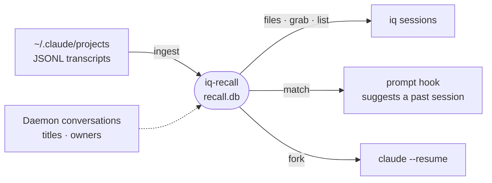

# iq-recall

Session recall behind `iq sessions`: indexes Claude Code transcripts so an agent can ask which files past sessions touched for a topic, find a related session, or fork one mid-way.



- The index is a disposable cache beside the search index (`.intentic/local/cache/iq/recall.db`). Ingest is incremental: unchanged transcripts are skipped and grown ones resume from their stored byte offset.
- Ranking is purely statistical, with no model calls: BM25 over prompts, responses and titles, recency decay, and inverse ubiquity so files every session touches (`package.json`) carry no weight.
- `forkPoint` suggests the turn that keeps the most still-valid context per token; `fork` writes a new transcript up to a chosen turn, which `claude --resume` opens.
- Transcript lines are read tolerantly: unknown shapes and fields pass through as undefined rather than failing the ingest.
- Inside a sandbox it joins sessions to the daemon's conversation titles; outside one that lookup is empty and nothing else changes.

## Key files

- [src/index.ts](src/index.ts) — `createRecall` and the `Recall` interface.
- [src/ingest/ingest.ts](src/ingest/ingest.ts) — incremental transcript mirroring.
- [src/rank/files.ts](src/rank/files.ts) — topic-to-file ranking.
- [src/rank/match.ts](src/rank/match.ts) — ranking past sessions against a new first prompt.
- [src/fork/fork-point.ts](src/fork/fork-point.ts) — the fork-point score over fresh and stale file reads.

## Commands

```sh
pnpm --filter @intentic/iq-recall test
```
