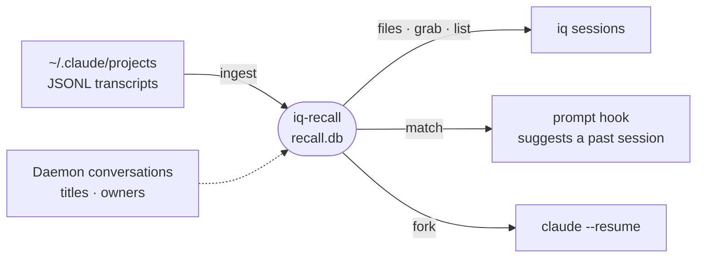

# iq-recall

Session recall behind `iq sessions`: indexes Claude Code transcripts so an agent can ask which files past sessions touched for a topic, find a related session, or fork one mid-way.


```mermaid
flowchart LR
    transcripts["~/.claude/projects<br/>JSONL transcripts"] -- "ingest" --> recall(["iq-recall<br/>recall.db"])
    fleet["Daemon conversations<br/>titles · owners"] -.-> recall
    recall -- "files · grab · list" --> iq["iq sessions"]
    recall -- "match" --> hook["prompt hook<br/>suggests a past session"]
    recall -- "fork" --> resume["claude --resume"]
```

- The index is a disposable cache beside the search index (`.intentic/local/cache/iq/recall.db`). Ingest is incremental: unchanged transcripts are skipped and grown ones resume from their stored byte offset. It is also safe to run twice at once (the prompt hook's budgeted pass and the SessionStart background pass overlap): a turn is unique per session, so the second pass stores nothing new.
- Ranking is purely statistical, with no model calls: BM25 over prompts, responses and titles, recency decay, and inverse ubiquity so files every session touches (`package.json`) carry no weight.
- Queries keep only a prompt's content terms: the shared stopwords from `@intentic/base/stopwords` and a short list of what agent prompts say without naming a topic ("please", "continue", "go ahead") are dropped, by the one tokenizer the FTS query and the match gate both use (`src/rank/terms.ts`).
- Prompts are the user's own words. Inside a sandbox the daemon puts notes in front of them (the project map, the checks note), the same few hundred words on every turn, so ingest stores a turn's prompt without them and every query takes them off before it is tokenized. Both use `stripInjectedPreamble` from `@intentic/constants`: a text that opens with `## ` or a dependency notice loses everything up to the first `\n\n---\n\n`, and any other text is left whole. The index's schema version went to 3 with it, so an older index rebuilds from the transcripts on its next open.
  - 2026-09-29: v3 rebuilds from the transcripts rather than migrating v2 rows in place. On a copy of a live v2 index every row a rebuild dropped was a duplicate (419 of 4,889, left by two ingests racing), and ingest already deletes a session whose transcript is gone, so an in-place migration would have kept nothing the rebuild loses.
  - 2026-09-29: the recogniser matches the note openings rather than holding the daemon's exact header list. Moving the headers to a shared package would have touched a dozen sandbox files, and transcripts still carry notes the daemon has since retired (`## Your branch moved onto newer main`, 205 turns in one live index), which an exact list would miss. A test in the sandbox (`agent/prompt/turn-preamble.test.ts`) fails when a header the daemon parses is not recognised here. Measured on a copy of a live index, the preamble had made 39 of 54 real first prompts strong matches; with it off, 17 are.
- A matched session is `strong`, the only kind the prompt hook shows the agent, on an absolute scale: the prompt names at least two content terms, and one turn of the session plus its title covers at least half of their IDF weight. The match score orders sessions but is scaled to the query's own best candidate, so it cannot say whether that candidate is any good.
- `forkPoint` suggests the turn that keeps the most still-valid context per token; `fork` writes a new transcript up to a chosen turn, which `claude --resume` opens.
- Transcript lines are read tolerantly: unknown shapes and fields pass through as undefined rather than failing the ingest.
- Inside a sandbox it joins sessions to the daemon's conversation titles; outside one that lookup is empty and nothing else changes.

## Key files

- [src/index.ts](src/index.ts) — `createRecall` and the `Recall` interface.
- [src/ingest/ingest.ts](src/ingest/ingest.ts) — incremental transcript mirroring.
- [src/rank/files.ts](src/rank/files.ts) — topic-to-file ranking.
- [src/rank/match.ts](src/rank/match.ts) — ranking past sessions against a new first prompt.
- [src/fork/fork-point.ts](src/fork/fork-point.ts) — the fork-point score over fresh and stale file reads.

## Commands

```sh
pnpm --filter @intentic/iq-recall test
```
