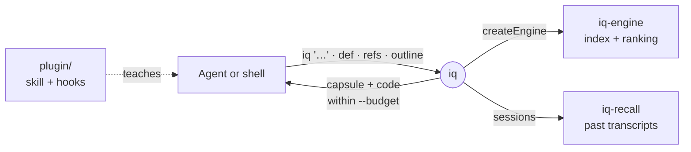

# iq

The `iq` CLI, agent-native workspace search that answers a symbol, path, regex or plain question with ranked `path:line` anchors in one call.



- A bare query picks its own strategy: a path, an identifier, a regex or natural language, falling back to semantic search when nothing matches exactly. There is no separate verb for questions.
- Every answer opens with a capsule: `answer:` names the top anchor, its enclosing symbol and whether it is confident or ambiguous; `candidates:` and `more:` follow. Output fits `--budget` tokens, capsule included.
- Exit codes follow grep (0 hits, 1 none, 2 error). Common grep flags get a one-line redirect instead of a usage dump.
- The index lives in `.intentic/local/cache/iq` and maintains itself; `iq index rebuild` is for a stale index only.
- `plugin/` is a Claude Code plugin: the `iq` skill, a SessionStart nudge that ingests transcripts, and a prompt hook that suggests matching past sessions. The sandbox image bakes it and loads it for every agent.

## Usage

```sh
iq "where do we enforce the secrets floor?"   # anything; intent is auto-detected
iq def createIgnoreScope                      # where a symbol is defined
iq refs createIgnoreScope --kind call         # who calls it
iq outline src/app.ts                         # a file's shape without reading it
iq read src/app.ts::Server::start             # one symbol's body
iq impact                                     # what the uncommitted change reaches, and its tests
iq sessions files "auth refresh"              # files past sessions touched for a topic
```

## Key files

- [src/app.ts](src/app.ts) — the verb table and the `--help` text agents read.
- [src/lib/run.ts](src/lib/run.ts) — the executor every search verb shares: engine, path resolution, output mode, exit code.
- [src/commands/q.command.ts](src/commands/q.command.ts) — the default verb behind a bare `iq "…"`.
- [src/commands/sessions/sessions.routes.ts](src/commands/sessions/sessions.routes.ts) — session recall verbs over `iq-recall`.
- [plugin/skills/iq/SKILL.md](plugin/skills/iq/SKILL.md) — which verb to reach for, as agents are taught it.
