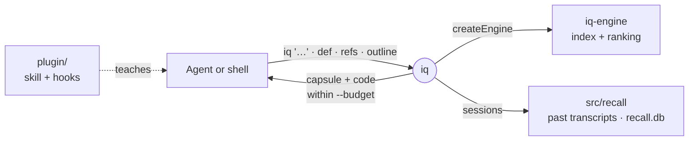
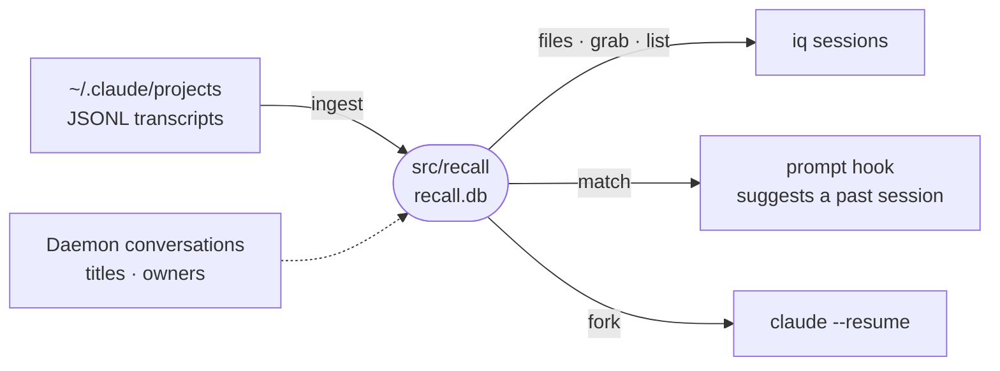

# iq

The `iq` CLI, agent-native workspace search that answers a symbol, path, regex or plain question with ranked `path:line` anchors in one call.


```mermaid
flowchart LR
    plugin["plugin/<br/>skill + hooks"] -. "teaches" .-> agent["Agent or shell"]
    agent -- "iq '…' · def · refs · outline" --> iq(["iq"])
    iq -- "createEngine" --> engine["iq-engine<br/>index + ranking"]
    iq -- "sessions" --> recall["src/recall<br/>past transcripts · recall.db"]
    iq -- "capsule + code<br/>within --budget" --> agent
```

- A bare query picks its own strategy: a path, an identifier, a regex or natural language, falling back to semantic search when nothing matches exactly. There is no separate verb for questions.
- Every answer opens with a capsule: `answer:` names the top anchor, its enclosing symbol and a verdict, `confident`, `ambiguous`, or `weak` when nothing retrieved likely answers and the thing asked about may not exist; `candidates:` and `more:` follow. Output fits `--budget` tokens, capsule included.
- Exit codes follow grep (0 hits, 1 none, 2 error). Common grep flags get a one-line redirect instead of a usage dump.
- `iq verify` reads an answer (a file, or stdin) and checks every reference in it against the index: cited files exist, `path:line` anchors fall inside their file and near the names the same line cites, and code names are defined or at least written somewhere here. It exits 0 when all hold and 1 when any does not, so a hook or CI step can gate on it.
- The index lives in `.intentic/local/cache/iq` and maintains itself; `iq index rebuild` is for a stale index only.
- `iq sessions` is session recall (`src/recall/`): it indexes Claude Code transcripts so an agent can ask which files
  past sessions touched for a topic, find a related session, or fork one mid-way ([below](#session-recall)). Its
  tolerant line readers are exported as `@intentic/iq/transcript`, whose `promptOf` says which user lines a person
  wrote; `@intentic/agent-context` finds turn boundaries with it, so the two readers of this format agree.
- `plugin/` is a Claude Code plugin: the `iq` skill, a SessionStart nudge that ingests transcripts, and a prompt hook that suggests matching past sessions. The sandbox image bakes it and loads it for every agent.

## Usage

```sh
iq "where do we enforce the secrets floor?"   # anything; intent is auto-detected
iq def createIgnoreScope                      # where a symbol is defined
iq refs createIgnoreScope --kind call         # who calls it
iq outline src/app.ts                         # a file's shape without reading it
iq read src/app.ts::Server::start             # one symbol's body
iq impact                                     # what the uncommitted change reaches, and its tests
iq verify answer.md                           # do an answer's paths, path:line anchors and names exist? exit 1 if not
iq sessions files "auth refresh"              # files past sessions touched for a topic
```

## Session recall


```mermaid
flowchart LR
    transcripts["~/.claude/projects<br/>JSONL transcripts"] -- "ingest" --> recall(["src/recall<br/>recall.db"])
    fleet["Daemon conversations<br/>titles · owners"] -.-> recall
    recall -- "files · grab · list" --> verbs["iq sessions"]
    recall -- "match" --> hook["prompt hook<br/>suggests a past session"]
    recall -- "fork" --> resume["claude --resume"]
```

- The index is a disposable cache beside the search index (`.intentic/local/cache/iq/recall.db`). Ingest is
  incremental: unchanged transcripts are skipped and grown ones resume from their stored byte offset. It is also safe to
  run twice at once (the prompt hook's budgeted pass and the SessionStart background pass overlap): a turn is unique per
  session, so the second pass stores nothing new.
- Ranking is purely statistical, with no model calls: BM25 over prompts, responses and titles, recency decay, and
  inverse ubiquity so files every session touches (`package.json`) carry no weight.
- Queries keep only a prompt's content terms: the shared stopwords from `@intentic/base/stopwords` and a short list of
  what agent prompts say without naming a topic ("please", "continue", "go ahead") are dropped, by the one tokenizer the
  FTS query and the match gate both use (`src/recall/rank/terms.ts`).
- Prompts are the user's own words. Inside a sandbox the daemon puts notes in front of them (the project map, the checks
  note), the same few hundred words on every turn, so ingest stores a turn's prompt without them and every query takes
  them off before it is tokenized. Both use `stripInjectedPreamble` from `@intentic/constants`: a text that opens with
  `## ` or a dependency notice loses everything up to the first `\n\n---\n\n`, and any other text is left whole. The
  index's schema version went to 3 with it, so an older index rebuilds from the transcripts on its next open.
  - 2026-09-29: v3 rebuilds from the transcripts rather than migrating v2 rows in place. On a copy of a live v2 index
    every row a rebuild dropped was a duplicate (419 of 4,889, left by two ingests racing), and ingest already deletes a
    session whose transcript is gone, so an in-place migration would have kept nothing the rebuild loses.
  - 2026-09-29: the recogniser matches the note openings rather than holding the daemon's exact header list. Moving the
    headers to a shared package would have touched a dozen sandbox files, and transcripts still carry notes the daemon
    has since retired (`## Your branch moved onto newer main`, 205 turns in one live index), which an exact list would
    miss. A test in the sandbox (`agent/prompt/turn-preamble.test.ts`) fails when a header the daemon parses is not
    recognised here. Measured on a copy of a live index, the preamble had made 39 of 54 real first prompts strong
    matches; with it off, 17 are.
- A matched session is `strong`, the only kind the prompt hook shows the agent, on an absolute scale: the prompt names
  at least two content terms, and one turn of the session plus its title covers at least half of their IDF weight. The
  match score orders sessions but is scaled to the query's own best candidate, so it cannot say whether that candidate
  is any good.
- `forkPoint` suggests the turn that keeps the most still-valid context per token; `fork` writes a new transcript up to
  a chosen turn, which `claude --resume` opens.
- Transcript lines are read tolerantly (`src/recall/transcript/lines.ts`): unknown shapes and fields pass through as
  undefined rather than failing the ingest. It is a second reader of the same files beside
  `@intentic/agent-context`'s `claude-transcript.ts`, on purpose: see that package's README.
- Inside a sandbox it joins sessions to the daemon's conversation titles; outside one that lookup is empty and nothing
  else changes.
- 2026-10-06: recall was its own published package, `@intentic/iq-recall`, until it folded into this one. `iq` was its
  only consumer; it is no longer published on its own.

## Key files

- [src/app.ts](src/app.ts) — the verb table and the `--help` text agents read.
- [src/lib/run.ts](src/lib/run.ts) — the executor every search verb shares: engine, path resolution, output mode, exit code.
- [src/commands/q.command.ts](src/commands/q.command.ts) — the default verb behind a bare `iq "…"`.
- [src/commands/verify.command.ts](src/commands/verify.command.ts) — `iq verify`, the grounding check for an answer's references.
- [src/recall/recall.ts](src/recall/recall.ts) — `createRecall`: ingest, topic-to-file ranking, session match and fork.
- [plugin/skills/iq/SKILL.md](plugin/skills/iq/SKILL.md) — which verb to reach for, as agents are taught it.
