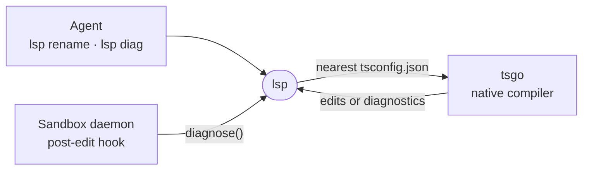

# lsp

The `lsp` CLI, which renames a TypeScript symbol across its project and reports compiler diagnostics by running the native TypeScript compiler once per question.



- Nothing stays resident. `lsp diag` runs `tsgo` over the file's project and exits; `lsp rename` holds one short language-server conversation with `tsgo --lsp` and applies the same edit an editor would.
- The CLI takes a symbol name. The first matching declaration in the file's outline anchors the rename; failing that, word-boundary occurrences are offered to the server in order.
- A project that cannot load cleanly (a broken config, missing type foundations) is reported as unavailable instead of producing false errors, and so is a compiler that crashes, is killed, or reports errors this reader cannot parse. A rename refuses in that state, since it could miss usages.
- A `*.test.ts` file is checked against a sibling `tsconfig.test.json` when one exists. `.vue` imports are left unchecked.
- The daemon's post-edit hook imports `./client`, where concurrent asks for one project pool into a single compiler run. In the sandbox the CLI is on `PATH` and the `lspTools` setting decides whether agents get its skill.

## Usage

```sh
lsp rename src/app.ts createServer startServer
lsp diag src/app.ts src/routes.ts
```

## Key files

- [src/cli.ts](src/cli.ts) — the two verbs and their exit codes.
- [src/rename.ts](src/rename.ts) — symbol anchoring and the language-server rename.
- [src/checker.ts](src/checker.ts) — one compiler run per project, and when it refuses.
- [src/client.ts](src/client.ts) — `diagnose`, the pooled entry point the sandbox hook uses.
- [src/report.ts](src/report.ts) — parsing compiler output into diagnostics and refusals.

## Commands

```sh
pnpm --filter @intentic/lsp test
```
