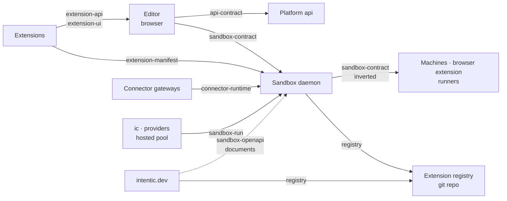

# Shared contracts

The wire contracts, extension SDKs and shared stylesheets that more than one part of intentic is written against, kept below every part so any part can depend on them.

| Package | Role |
| --- | --- |
| [api-contract](api-contract) | oRPC contract between the editor and the platform api. |
| [capability-catalog](capability-catalog) | Capability tiles, their add forms and what connecting one does. |
| [connector-runtime](connector-runtime) | Gateway shell the chat connector extensions run on. |
| [entry-css](entry-css) | The site's look for sign-in, setup and desktop handoff screens. |
| [extension-api](extension-api) | Versioned host API an extension's code programs against. |
| [extension-manifest](extension-manifest) | Schema of `intentic-extension.json`, what an extension declares. |
| [extension-ui](extension-ui) | Host-provided UI kit extensions render with. |
| [house-css](house-css) | Bronze, cartouche and ember materials the site and app share. |
| [registry](registry) | Extension registry file format: sha-pinned pointers, trust, scan facts. |
| [relay](relay) | How the edge and the sandbox's front relay HTTP over a tunnel's streams (Rust). |
| [sandbox-contract](sandbox-contract) | Wire contract between the editor and the sandbox daemon. |
| [sandbox-openapi](sandbox-openapi) | The daemon's contract as an OpenAPI 3.1 document. |
| [sandbox-run](sandbox-run) | How a sandbox container starts: names, privileges, env, Fly config. |
| [workspace-ignore](workspace-ignore) | Which workspace paths are project files and which are noise. |

## The boundary

Nothing in `_shared/` depends on another part. A package here may depend on other `_shared/` packages and on the
`_tools/` foundation, counting a `_tools/` package only while it too stays off the other parts. That keeps a contract
cheap to take: depending on one never pulls in a second part.
[`shared-boundary.mjs`](../_tools/checks/shared-boundary.mjs) enforces the rule on every manifest and import, type-only
imports included, and records each standing exception with its reason:

- `api-contract` imports `ResourceType` from [`_deploy/resources`](../_deploy/resources). The type stays in `_deploy/`
  because its other dependents are all deploy-internal.
- `extension-ui` re-exports [`_editor/ui`](../_editor/ui), because the kit is a slice of the app's own design system.
