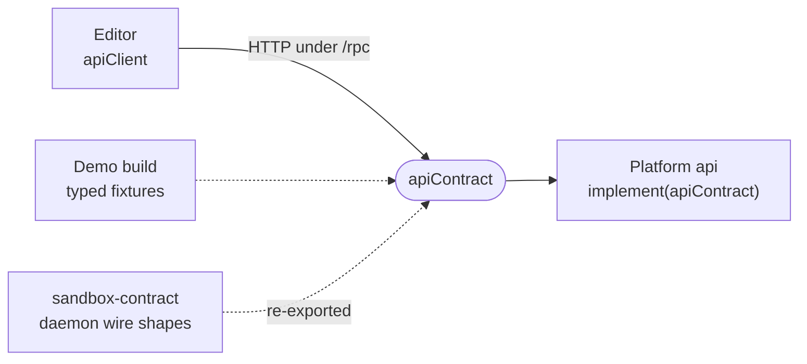

# api-contract

The oRPC contract between the editor and the platform api: accounts, the sandbox registry, invites, hosted plans, push relay, wallet, admin reads and API tokens.

- Both ends are typed from the same `apiContract`: the browser's `OpenAPILink` client in `_editor/web` and the
  per-domain handlers in `_platform/api`, mounted under `API_BASE_PATH` (`/rpc`).
- `src/schemas.ts` holds two kinds of shape. Platform-native ones (users, hosted plans, invites, tokens) are defined
  here; daemon wire shapes are re-exported from `@intentic/sandbox-contract`, so the editor imports one module for
  both.
- Nothing between the editor and a sandbox travels over it: the editor talks to the daemon directly over
  `sandbox-contract`.
- `ResourceType` comes from `_deploy/resources`, a recorded exception to the rule that `_shared/` depends on no other
  part (see [the area README](../README.md)).

## Key files

- [src/index.ts](src/index.ts) — `apiContract`: every platform route, grouped by domain, with who may call it.
- [src/schemas.ts](src/schemas.ts) — platform schemas, re-exported daemon shapes, and limits such as `SANDBOX_RECOVERY_DAYS`.
- [../../_platform/api/src/router.ts](../../_platform/api/src/router.ts) — where the per-domain handlers are assembled into the contract's shape.
- [../../_editor/web/src/lib/useApi.ts](../../_editor/web/src/lib/useApi.ts) — the single typed client the editor uses.
