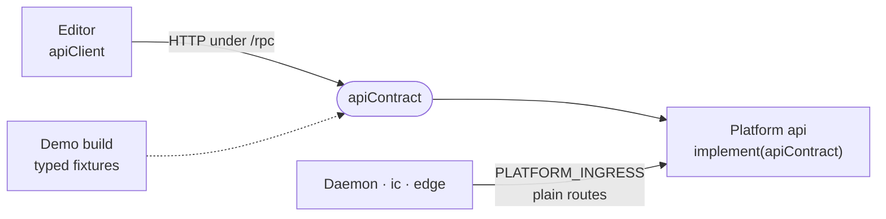

# api-contract

The contracts the platform api is written against: the editor's oRPC contract, and the table of plain routes machines call on it.

```mermaid
flowchart LR
    web["Editor<br/>apiClient"] -- "HTTP under /rpc" --> contract(["apiContract"])
    demo["Demo build<br/>typed fixtures"] -.-> contract
    contract --> api["Platform api<br/>implement(apiContract)"]
    machines["Daemon · ic · edge"] -- "PLATFORM_INGRESS<br/>plain routes" --> api
```

- Both ends are typed from the same `apiContract`: the browser's `OpenAPILink` client in `_editor/web` and the
  per-domain handlers in `_platform/api`, mounted under `API_BASE_PATH` (`/rpc`). It covers accounts, the sandbox
  registry, invites, hosted plans, push relay, wallet, admin reads and API tokens.
- `src/ingress/` is the other contract: `PLATFORM_INGRESS`, every route a machine calls outside `/rpc` (the daemon's
  announce, boot report and wallet calls, `ic`'s setup claim and host report, the edge's reachability lookup), each
  with its method, path, credential and body and answer schemas. The platform registers handlers under it and the
  daemon calls it by route name, importing `@intentic/api-contract/ingress` alone. A route table rather than oRPC:
  the paths sit at the root, are called by machines of every release, take header credentials, one takes a form and
  answers text, two stream an upstream's bytes, and every refusal is `{ "error": … }`, which older daemons and `ic`
  already read. A request field is added optional, and a label a machine sends about itself is dropped when it does
  not parse rather than refusing the call. Its test pins the old body shapes, and the Rust and shell callers'
  spellings of the paths and of `CONNECT_TOKEN_HEADER`.
- `src/schemas.ts` holds the platform's own shapes: users, hosted plans, invites, tokens, the admin reads. It
  re-exports nothing of the daemon's: a daemon wire shape is imported from `@intentic/sandbox-contract`, so which
  contract a type belongs to is read off its import. A platform shape may still be built from a daemon one (a member's
  `GrantedRole`, a push's `PushNotification`).
- A field the platform adds is optional on both sides, so an older editor and an older platform keep talking to a newer
  one. A capability the editor acts on is announced rather than inferred: `hostedOffer.projects` says the platform
  reads `hostedProvision`'s `project` (a folder name held to sandbox-contract's `isProjectDirName`), and an editor
  that does not see it keeps a project on the reader's own computer.
- Nothing between the editor and a sandbox travels over it: the editor talks to the daemon directly over
  `sandbox-contract`. A name means one thing across the two: the platform's minted ticket is `MintedOwnerTicket`
  (sandbox-contract's `OwnerTicket` is the claim a daemon decodes), and its sandbox domain is
  `sandboxRegistryContract`.
- `ResourceType` comes from `_deploy/resources`, a recorded exception to the rule that `_shared/` depends on no other
  part (see [the area README](../README.md)).

## Key files

- [src/index.ts](src/index.ts) — `apiContract`: every platform route, grouped by domain, with who may call it.
- [src/schemas.ts](src/schemas.ts) — platform schemas and limits such as `SANDBOX_RECOVERY_DAYS`.
- [src/ingress/routes.ts](src/ingress/routes.ts) — `PLATFORM_INGRESS`: every route a machine calls, and what proves the caller.
- [../../_platform/api/src/router.ts](../../_platform/api/src/router.ts) — where the per-domain handlers are assembled into the contract's shape.
- [../../_editor/web/src/lib/useApi.ts](../../_editor/web/src/lib/useApi.ts) — the single typed client the editor uses.
