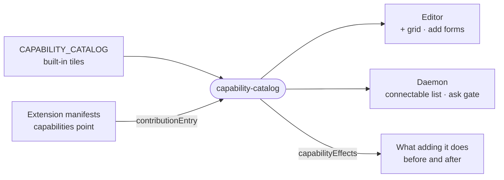

# capability-catalog

The catalog of capability tiles an owner can connect, with each tile's add form and the side effects connecting it has, shared by the editor and the daemon.



- The daemon merges `CAPABILITY_CATALOG` with the enabled extensions' contributed tiles for the agent's
  connectable list, and uses `instancesOf` to tell whether a tile already has a live connection before asking the
  owner in chat.
- `capabilityEffects` derives what adding a tile does (a skill written, a secret exposed, an image rebuild, a privileged
  runtime directive) from the same data the handlers consume, so no card keeps a hand-written list.
- Product data only: this package holds no wire schemas. Kinds and exit-point vocabularies come from
  `@intentic/sandbox-contract`.
- Also here: `INVENTORY_SERVICES` for the infra panel's "Add service" dialog, and the memory sizing for local model
  tiles, printed in binary gigabytes because it is compared against a machine's RAM.

## Key files

- [src/index.ts](src/index.ts) — the tile list, categories, `contributionEntry` and `instancesOf`.
- [src/effects.ts](src/effects.ts) — `CapabilityEffect` and the per-kind table behind `capabilityEffects`.
- [src/index.test.ts](src/index.test.ts) — how a contribution becomes a tile, and the local model tile's sizing.
- [src/effects.test.ts](src/effects.test.ts) — which effects each kind discloses.

## Commands

```sh
pnpm --filter @intentic/capability-catalog test
```
