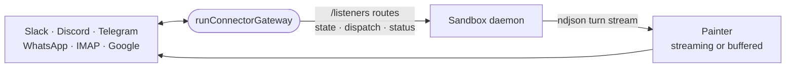

# connector-runtime

The gateway runtime every chat connector extension runs on: the reconcile loop, the daemon client, reply painters and listener memory, written once for all providers.



- Runs in the sandbox as each connector extension's auto-started process, not inside the daemon. The daemon holds no
  provider connection; the gateway opens them and talks to the daemon only through the provider-scoped listener
  routes, authenticated with `INTENTIC_PANEL_TOKEN`.
- `runConnectorGateway` reconciles the connections a connector wants against the daemon's state on a timer, backs off
  after a fatal connect, reports status, serves `/health`, and shuts down on SIGTERM. A connector supplies only its
  `GatewayHooks`.
- Painters turn a reply into chat messages: `createStreamingPainter` grows one message by edits and spills into the
  next at a size limit; `createBufferedPainter` sends once at the end, for providers that flag rapid edits.
- Listener memory (duplicate delivery keys, chat rings, typing heartbeats) is bounded and forgotten on restart.
- One process holds every connection, so once it is serving, a stray rejection in one connector is logged instead of
  taking the rest down. A gateway that cannot start still exits non-zero, and its reports to the daemon never reject.

## Key files

- [src/gateway.ts](src/gateway.ts) — `runConnectorGateway`, `GatewaySpec` and the hooks a connector implements.
- [src/daemon.ts](src/daemon.ts) — the client for the daemon's listener routes.
- [src/painter.ts](src/painter.ts) — streaming, buffered and per-automation painters.
- [src/listener-memory.ts](src/listener-memory.ts) — dedupe keys, chat rings and typing heartbeats.

## Commands

```sh
pnpm --filter @intentic/connector-runtime test
```
