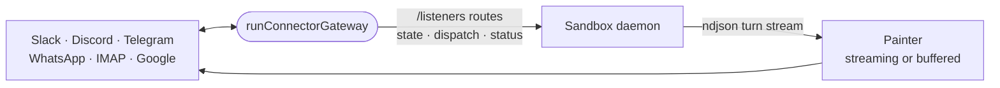

# connector-runtime

The gateway runtime every chat connector extension runs on: the reconcile loop, the daemon client, reply painters and listener memory, written once for all providers.


```mermaid
flowchart LR
    provider["Slack · Discord · Telegram<br/>WhatsApp · IMAP · Google"] <--> gateway(["runConnectorGateway"])
    gateway -- "/listeners routes<br/>state · dispatch · status" --> daemon["Sandbox daemon"]
    daemon -- "ndjson turn stream" --> painter["Painter<br/>streaming or buffered"]
    painter --> provider
```

- Runs in the sandbox as each connector extension's auto-started process, not inside the daemon. The daemon holds no
  provider connection; the gateway opens them and talks to the daemon only through the provider-scoped listener
  routes, over the process's own extension api (`connectExtensionProcess` from `@intentic/extension-api/runtime`, the
  api a `server` bundle is handed), which presents the extension's own token. A connector gets that api as `ctx.api`:
  its state directory (`ctx.api.stateDir`, where WhatsApp keeps its sessions and IMAP its watermarks), its settings and
  the workspace's events. The daemon answers those routes only for the extension whose manifest names that provider as
  its listener, and `/state` hands it only the connectors whose card that extension contributes. Their paths and the
  `/state` feed's schema come from the contract's `./listener-protocol` subpath, the declaration the daemon serves
  from, so a gateway loads no more of the contract.
- `runConnectorGateway` reconciles the connections a connector wants against the daemon's state on a timer, backs off
  after a fatal connect, reports status, serves `/health`, and shuts down on SIGTERM. A connector supplies only its
  `GatewayHooks`.
- Painters turn a reply into chat messages: `createStreamingPainter` grows one message by edits and spills into the
  next at a size limit; `createBufferedPainter` sends once at the end, for providers that flag rapid edits.
- `paintReply` dispatches a message that addressed us and paints each automation's answer back with one of those
  painters, posting a failed turn's notice and retiring the typing indicator; `deliverChunked` is the `/deliver` door's
  chunk loop, trying the next bot only while nothing has posted. Each platform's one-message ceiling is the contract's
  `MESSAGE_LIMITS`, re-exported here; how a platform decides a message is addressed to us stays in its gateway.
- Listener memory (duplicate delivery keys, chat rings, typing heartbeats) is bounded and forgotten on restart, with the
  defaults every gateway shares (`RECENT_KEYS_MAX`, `HISTORY_LIMIT`, `TYPING_MAX_MS`).
- A gateway with a CLI publishes its loopback address at the contract's `extensionGatewayUrlFile`, keyed by provider
  beside the extensions' own directories; the CLI finds it with `readGatewayUrl`, which walks up from wherever the agent
  stands.
- One process holds every connection, so once it is serving, a stray rejection in one connector is logged instead of
  taking the rest down. A gateway that cannot start still exits non-zero, and its reports to the daemon never reject.

## Key files

- [src/gateway.ts](src/gateway.ts) — `runConnectorGateway`, `GatewaySpec` and the hooks a connector implements.
- [src/daemon.ts](src/daemon.ts) — the client for the daemon's listener routes.
- [src/painter.ts](src/painter.ts) — streaming, buffered and per-automation painters.
- [src/reply.ts](src/reply.ts) — `paintReply`, `deliverChunked` and the shared listener constants.
- [src/listener-memory.ts](src/listener-memory.ts) — dedupe keys, chat rings and typing heartbeats.

## Commands

```sh
pnpm --filter @intentic/connector-runtime test
```
