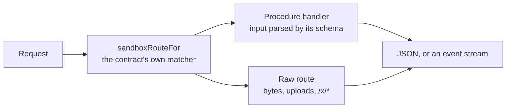

# contract-serve

Answers sandbox-contract requests from a table of typed handlers, as a fetch handler, for whatever stands in for a sandbox's daemon: the interactive demo's in-page fixture and the desktop app's local files sidecar.

- `serve(procedures, raw, unserved, voice)` resolves a request by the contract's route table, decodes a procedure's
  input the way oRPC's handler does and parses it with the procedure's own schema, and types every handler by the
  contract, so a contract change breaks its callers' typecheck rather than their runtime.
- A handler refuses with `refuse(message, status)`, answered in the daemon's own `{ error }` body. A streamed
  procedure (`/events`) answers `Frames`, written in oRPC's event-iterator wire format (`sse.ts`).
- A request nothing answers gets a 404 and one log line in the caller's voice, with the reason `unserved` gives for
  that route.

## Key files

- [src/router.ts](src/router.ts) — matching a request to its route, decoding its input, typing each answer.
- [src/sse.ts](src/sse.ts) — the event-iterator wire format and the stream's teardown.
- [src/index.ts](src/index.ts) — what the demo and the sidecar import.
