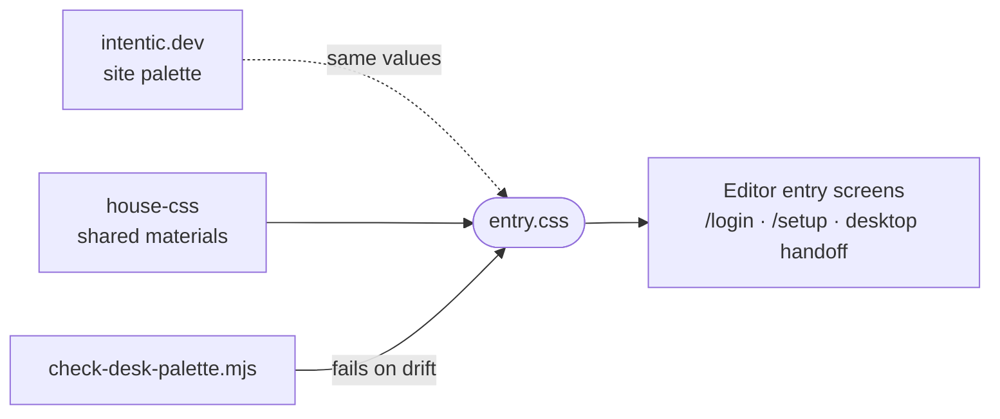

# entry-css

The site's design vocabulary as a stylesheet scoped to `.entry`, worn by the editor's sign-in, setup and desktop handoff screens so they match intentic.dev.

- Everything is scoped to `.entry`, so the rest of the editor keeps its own theme. Inside it, the design system's
  `--color-*` roles are re-pointed to the site's gold-on-dark values, and the plate, frames, cartouche buttons and seal
  are defined as classes.
- A light block keyed on the colour scheme (`html:not([data-mode="dark"]) .entry`) dresses the same screens in the
  site's light skin for anyone reading in light mode.
- The site's `check-desk-palette.mjs` reads this file and fails when its light block's house materials or scrim part
  from the site's own values.
- A stylesheet only, reached by a relative `@import` from `_editor/web/src/styles.css`; screens add layout, never
  colour.

## Key files

- [entry.css](entry.css) — the skin: roles, the plate, frames, controls, the seal and the light-scheme block.
- [../../_editor/web/src/features/auth/Login.vue](../../_editor/web/src/features/auth/Login.vue) — a typical wearer: layout only, materials from here.
- [../../_editor/web/src/styles.css](../../_editor/web/src/styles.css) — where the editor imports it.
- [../../_site/site/scripts/check-desk-palette.mjs](../../_site/site/scripts/check-desk-palette.mjs) — the drift check against the site's palette.
