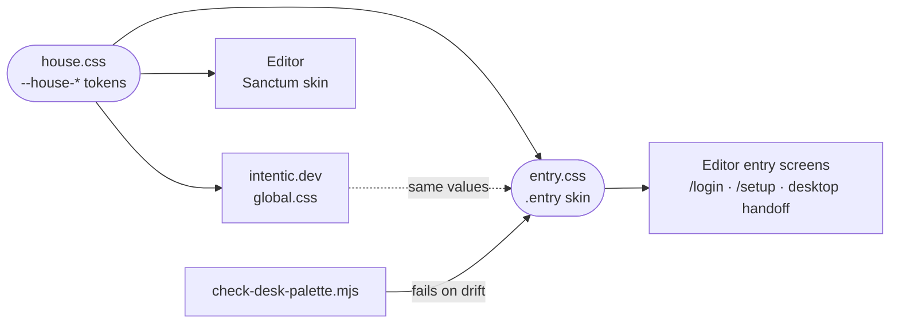

# entry-css

The house materials the site and the editor share, and the site's design vocabulary scoped to `.entry` for the editor's sign-in, setup and desktop handoff screens.

```mermaid
flowchart LR
    house(["house.css<br/>--house-* tokens"]) --> site["intentic.dev<br/>global.css"]
    house --> sanctum["Editor<br/>Sanctum skin"]
    house --> entry(["entry.css<br/>.entry skin"])
    site -. "same values" .-> entry
    entry --> screens["Editor entry screens<br/>/login · /setup · desktop handoff"]
    check["check-desk-palette.mjs"] -- "fails on drift" --> entry
```

Two stylesheets, one package. Consumers reach both by a relative `@import`, not a package import, which is why
`knip.json` ignores the dependency.

## house.css

- One `:root` block of `--house-*` variables and nothing else: cast bronze, notched cartouche frames and ember glows.
  No selectors, no layout. Each consumer decides where a material goes.
- Ember is for small marks (a headline's full stop, the current step), never broad fills.
- The site imports only this file. The editor imports it ahead of its skins and of `entry.css`, which paints with it.

## entry.css

- Everything is scoped to `.entry`, so the rest of the editor keeps its own theme. Inside it, the design system's
  `--color-*` roles are re-pointed to the site's gold-on-dark values, and the plate, frames, cartouche buttons and seal
  are defined as classes.
- A light block keyed on the colour scheme (`html:not([data-mode="dark"]) .entry`) dresses the same screens in the
  site's light skin for anyone reading in light mode. It carries its own light copy of the house materials.
- The site's `check-desk-palette.mjs` reads this file and fails when that light block's house materials or scrim part
  from the site's own light values.
- Screens add layout, never colour.

(2026-10-06: the house materials were their own package, `house-css`, until they joined this one. Both are
stylesheets reached by relative path, so the second manifest resolved nothing.)

## Key files

- [house.css](house.css) — the bronze, cartouche and ember tokens.
- [entry.css](entry.css) — the entry skin: roles, the plate, frames, controls, the seal and the light-scheme block.
- [../../_editor/web/src/styles.css](../../_editor/web/src/styles.css) — where the editor imports both.
- [../../_site/site/src/styles/global.css](../../_site/site/src/styles/global.css) — the site's import of the house materials.
- [../../_editor/web/src/features/auth/Login.vue](../../_editor/web/src/features/auth/Login.vue) — a typical wearer: layout only, materials from here.
- [../../_site/site/scripts/check-desk-palette.mjs](../../_site/site/scripts/check-desk-palette.mjs) — the drift check against the site's palette.
