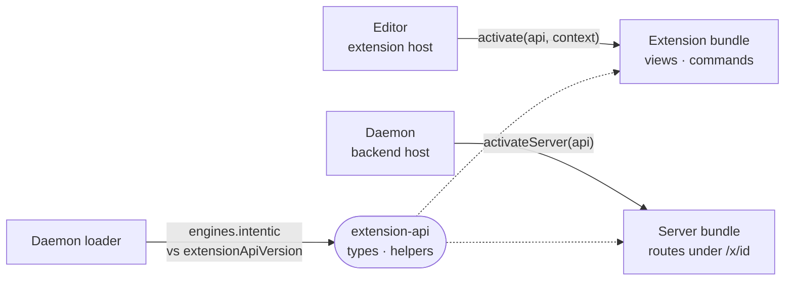

# extension-api

The versioned public API an intentic extension compiles against: `IntenticApi` for its browser half, `ExtensionServerApi` for its backend half, and the helpers both halves share.

- There is no ambient global. The host hands `IntenticApi` to `activate(api, context)`, and everything registered
  returns a `Disposable`. A manifest's `server` bundle gets `ExtensionServerApi` in a Node process shared by every
  enabled extension, and reaches daemon routes only as far as `permissions.daemon` allows.
- This package is the one exception to the repo's no-legacy rule. It is published to npm, `extensionApiVersion` moves
  with every surface change (additive is a minor), and a manifest's `engines.intentic` range is matched against it at
  load, failing closed. The editor's `surface-guard.test.ts` fails when the surface moves without a new entry in
  `src/surface.json`.
- Helpers every extension needs live here too: sandbox-scoped module state (`sandboxRef`, cleared on every sandbox
  switch), background polling for rail badges, `sandboxLedger` (whose writes reject rather than overwrite a file they
  could not read), SSE and ndjson stream reading, and the payload for
  `api.workspace.openDiff`.
- Contribution points: `agent`, `automationTemplates`, `bin`, `capabilities`, `commands`, `documents`,
  `environment`, `files`, `listener`, `processes`, `settings`, `viewers` and `views`, plus the manifest's top-level
  fields, all read off `CONTRIBUTION_POINTS` in
  [extension-manifest](../extension-manifest/src/points/index.ts).
- `./protocol` exports only the version and the engines matcher, for the daemon, which cannot load the Vue-dependent
  barrel.

## Key files

- [src/api.ts](src/api.ts) — `IntenticApi`, `ExtensionContext` and the module shape a bundle exports.
- [src/server.ts](src/server.ts) — `ExtensionServerApi`, the backend half.
- [src/version.ts](src/version.ts) — `extensionApiVersion` and what each version added.
- [src/surface.json](src/surface.json) — the recorded public surface, per version.
- [src/scope.ts](src/scope.ts) — module state that belongs to one sandbox.
- [src/background.ts](src/background.ts) — `sandboxPoll` and `sandboxLedger` for work done off screen.
