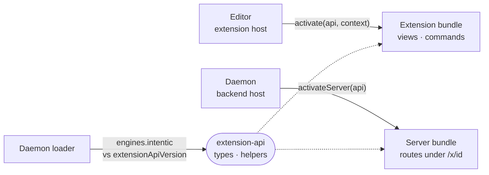

# extension-api

The versioned public API an intentic extension compiles against: `IntenticApi` for its browser half, `ExtensionServerApi` for its backend half, and the helpers both halves share.


```mermaid
flowchart LR
    web["Editor<br/>extension host"] -- "activate(api, context)" --> view["Extension bundle<br/>views · commands"]
    backend["Daemon<br/>backend host"] -- "activateServer(api)" --> server["Server bundle<br/>routes under /x/id"]
    sdk(["extension-api<br/>types · helpers"]) -.-> view
    sdk -.-> server
    loader["Daemon loader"] -- "engines.intentic<br/>vs extensionApiVersion" --> sdk
```

- There is no ambient global. The host hands `IntenticApi` to `activate(api, context)`, and everything registered
  returns a `Disposable`. A manifest's `server` bundle gets `ExtensionServerApi` in a Node process shared by every
  enabled extension, and reaches daemon routes only as far as `permissions.daemon` allows. The browser half reaches
  its own backend through `api.backend`, by a path relative to its namespace, never by spelling `/x/<id>`.
- The backend api is one shape wherever an extension's Node code runs. `./runtime` builds it: `createServerApi` for the
  daemon's backend host, and `connectExtensionProcess` for a declared process, which gets the same api less the two
  slots only the host serves (`ExtensionProcessApi`: no `routes`, no `tools`). Besides the daemon it carries the
  extension's own `stateDir` and `cacheDir` (keyed by its identity, made before its code runs, deleted with it),
  `document` (a JSON file there, evolved by the same `conversions` as `sandboxDocument`), `settings` (its own values,
  secrets included, and `onDidChange`) and `workspace` (file, ref and repository changes). Settings and events ride two
  routes every extension token reaches without declaring them. `./runtime` also exports the backend's types, so a
  gateway's program never loads the browser half's, which name Vue's.
- `activateServer` may hand back `{ deactivate, health }`. With a `deactivate`, a change to that extension alone (a
  rebuild, an update, dev mode) reloads it in the running host and every other backend keeps running; without one, the
  host restarts. Stopping the host deactivates every backend first. `health` answers `ok`, `starting`, `degraded` or
  `failed` with a sentence, read on the host's sweep and shown on the extension's row; a failed one after an update
  counts as a failed update. Both run under the host's deadlines.
- `./testing` holds `fakeExtensionApi`: the real backend api on a fake daemon that judges every call by the reach rule
  the daemon's grant applies (extension-manifest's `extensionRouteReach`), answers the extension's own settings and
  event stream, and hands the rest to the test. A backend's activation, routes, tools, health and deactivate run as the
  host runs them.
- An extension gives the agent tools one way: `contributes.tools`, served by `api.tools.serve((card) => [...])` in
  the backend. The host owns the MCP transport, each call's deadline and the card lookup, and hands the card's
  settings with every call; the daemon mounts the server into every turn on every runtime. Each tool may declare its
  `effect` (`read`, `write` or `destructive`, the `ToolEffect` words the daemon's own tools use), which the host lists
  as MCP annotations with both hints spelled out; a tool that declares none is listed without them, and Claude Code
  runs it alone as a destructive write. A plugin's `.mcp.json` is
  deprecated, and a cli card's `mcp` is kept one release as an alias.
- This package is published to npm, and its API only grows within a major. `extensionApiVersion` moves
  with every surface change (additive is a minor), and a manifest's `engines.intentic` range is matched against it at
  load, failing closed. The editor's `surface-guard.test.ts` fails when the surface moves without a new entry in
  `src/surface.json`, which records the api's members, from 2.20.0 a digest of the whole generated manifest
  schema, since a host's parse drops a field it does not know at any depth, from 2.21.0 `ToolDefinition`'s fields, and
  from 2.22.0 `api.sideViews`' members and `SideViewRegistration`'s fields.
- Helpers every extension needs live here too: sandbox-scoped module state (`sandboxRef`, cleared on every sandbox
  switch), background polling for rail badges, `sandboxLedger` (whose writes reject rather than overwrite a file they
  could not read), `sandboxDocument` (a file of the extension's own read through the `conversions` its shape has had,
  by the contract's `readDocument`, and written with what a newer version of the extension put in it kept; every handle
  on one path shares one write queue), SSE and ndjson stream reading, and the
  payload for `api.workspace.openDiff`.
- Contribution points: `agent`, `automationTemplates`, `bin`, `capabilities`, `commands`, `documents`,
  `environment`, `files`, `listener`, `processes`, `settings`, `sideViews`, `tools`, `viewers` and `views`, plus the
  manifest's top-level fields, all read off `CONTRIBUTION_POINTS` in
  [extension-manifest](../extension-manifest/src/points/index.ts).
- A side view (`sideViews`, `api.sideViews`) is something an extension shows in the editor's side panel for one input,
  beside whichever section the reader is in: the host owns the panel and the tab, the extension says what the tab reads
  (`describe`), where "Open in …" goes (`home`, also where a phone goes, having no side panel), and draws the body with
  the input bound. Its input is plain values, since a tab survives a reload and travels between windows, and its body
  never touches `api.route`, which belongs to the section beside it. With `links: true` it may `claim` links the chat
  renders, which then open beside the chat instead of in a new browser tab.
- A view that badges (`badge: true` on its manifest entry) may also itemise what a person owes it: `asks` returns one
  `ViewAsk` per decision, which the host draws in its Needs you inbox beside what agents are waiting on, with up to
  three presses answered in place and an `open` path back to the view for editing, scheduling and history. Read it off
  module state that stays current while the view is closed (`sandboxPoll`), as the badge is.
- `./protocol` exports only the version and the engines matcher, for the daemon, which cannot load the Vue-dependent
  barrel. `./runtime` and `./testing` are Node-only and free of Vue too.

## Key files

- [src/api.ts](src/api.ts) — `IntenticApi`, `ExtensionContext` and the module shape a bundle exports.
- [src/server.ts](src/server.ts) — `ExtensionServerApi`, the backend half.
- [src/runtime.ts](src/runtime.ts) — the backend api built for the host and for a process, activation and its deadlines.
- [src/testing.ts](src/testing.ts) — `fakeExtensionApi`, a backend under test on a fake daemon.
- [src/version.ts](src/version.ts) — `extensionApiVersion` and what each version added.
- [src/surface.json](src/surface.json) — the recorded public surface, per version.
- [src/scope.ts](src/scope.ts) — module state that belongs to one sandbox.
- [src/background.ts](src/background.ts) — `sandboxPoll` and `sandboxLedger` for work done off screen.

## Commands

```sh
pnpm --filter @intentic/extension-api test
```
