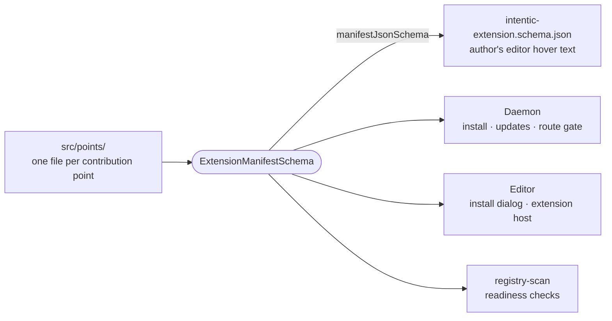

# extension-manifest

The schema of `intentic-extension.json`: what an extension declares it contributes and may reach, which the install dialog shows and the host holds every registration to.



- `manifest.ts` is the envelope. Each contribution point (views, commands, capabilities, listener, processes and the
  rest) is a `ContributionPoint` in `src/points/`, carrying the sentence an author sees as hover text.
- The runtime parse is lenient and the authoring schema strict, since an unknown key in an author's file is a typo.
  The generated schema is committed twice, here and in the site's `public/` behind `MANIFEST_SCHEMA_URL`, and the
  editor's `manifest-schema.test.ts` fails when either copy is stale.
- `sandboxRouteAllowed` is the permission rule: an entry is `"<METHOD> <path-glob>"`, and each `*` matches one path
  segment.
- What a field MEANS to the host is declared on the field, with `.meta({ power, effect, mintsServer })`
  (`meaning.ts`), and read from there: the powers `diffPowers` folds a manifest into (so an update re-asks only
  when it adds one), the effects a card discloses in the capability catalog, and the capability kinds whose ids
  become `mcp__<id>__` servers in the contract's reserved-name check. A new field is either given a meaning where it
  is defined or has none.
- `toolServersOf` is the one reading of which MCP servers a manifest serves the agent: `contributes.tools`, or a cli
  card's `mcp`, its alias for one release. A `superRefine` on the envelope says what no single field can: tools need
  a `server` bundle or a declared process to serve them.
- `HOST_PUBLISHED_SPECIFIERS` lists the only bare imports a published bundle may use: the modules the shell's import
  map provides.

## Key files

- [src/manifest.ts](src/manifest.ts) — `ExtensionManifestSchema`, the envelope.
- [src/points/index.ts](src/points/index.ts) — every contribution point, assembled into `contributes`.
- [src/permissions.ts](src/permissions.ts) — the sandbox-route allowlist rule.
- [src/meaning.ts](src/meaning.ts) — the meaning a field declares, and the walk that reads it off a manifest.
- [src/powers-diff.ts](src/powers-diff.ts) — what an update asks for, as set arithmetic over powers.
- [intentic-extension.schema.json](intentic-extension.schema.json) — the generated authoring schema.

## Commands

```sh
pnpm --filter @intentic/extension-manifest schema   # regenerate both copies of the authoring schema
```
