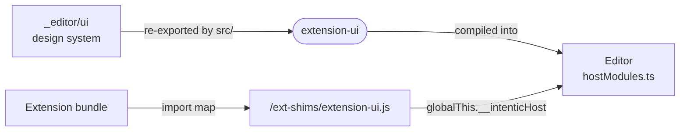

# extension-ui

The UI kit extensions render with: a curated slice of the editor's design system that the host supplies at runtime, so extension views use the shell's own component instances.



- `src/index.ts` re-exports chosen components and helpers from `@intentic/ui` (`_editor/ui`) plus the PrimeVue
  primitives extension views use. Nothing is reimplemented, so an extension view looks and behaves like the shell
  around it. This dependency on `_editor/ui` is a recorded exception to the [`_shared/` boundary](../README.md).
- At runtime the host supplies the kit: `hostModules.ts` publishes the editor's own module instances on
  `globalThis.__intenticHost`, and the import map in the editor's `index.html` resolves `@intentic/extension-ui` to a
  shim that reads them. A second copy would render unthemed, outside the app's reactivity and its query cache.
- `scripts/build.mjs` compiles the published package from `_editor/ui`'s sources: declarations pruned to what the kit
  re-exports, and a `dist/index.js` bridge that throws when loaded outside an intentic host.
- `names.mjs` lists the runtime export names by hand, because the `.vue` graph cannot load in Node. The editor's shim
  generator reads it, and a dev-time assertion in `hostModules.ts` catches drift.
- `./diff`, `./format`, `./i18n` and `./worker` skip the component barrel, for extension tests that run without a Vue
  compiler. `./worker` is also what a worker module imports `serveWorkerCall` from. A worker has no host bridge, so an
  extension built outside this repository bundles that module into its worker instead of marking it external.

## Key files

- [src/index.ts](src/index.ts) — the kit: every name an extension may import, with usage notes.
- [scripts/build.mjs](scripts/build.mjs) — builds the published types and the host bridge from `_editor/ui`.
- [names.mjs](names.mjs) — the runtime export names the shims and the host check read.
- [../../_editor/web/src/extension-host/hostModules.ts](../../_editor/web/src/extension-host/hostModules.ts) — where the shell publishes its instances to extension bundles.

## Commands

```sh
pnpm --filter @intentic/extension-ui build
```
