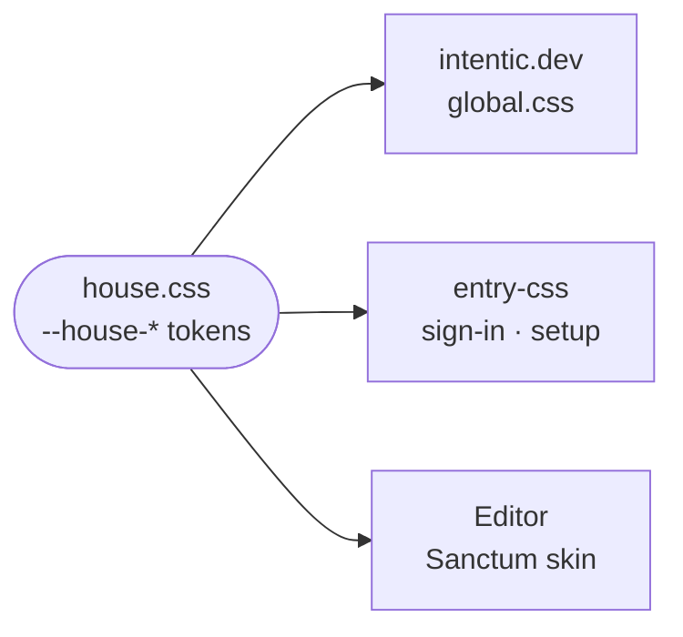

# house-css

The house materials as CSS custom properties: cast bronze, notched cartouche frames and ember glows, shared by the marketing site, the editor's entry screens and the Sanctum skin.

- One `:root` block of `--house-*` variables and nothing else: no selectors, no layout. Each consumer decides where a
  material goes.
- Ember is for small marks (a headline's full stop, the current step), never broad fills.
- Consumers reach it by a relative `@import`, not a package import, which is why `knip.json` ignores it as a
  dependency.

## Key files

- [house.css](house.css) — the bronze, cartouche and ember tokens.
- [../../_site/site/src/styles/global.css](../../_site/site/src/styles/global.css) — the site's import.
- [../../_editor/web/src/styles.css](../../_editor/web/src/styles.css) — the editor's import, ahead of its skins and the entry skin.
- [../../_editor/web/src/skins/sanctum.css](../../_editor/web/src/skins/sanctum.css) — the app skin that wears the bronze.
