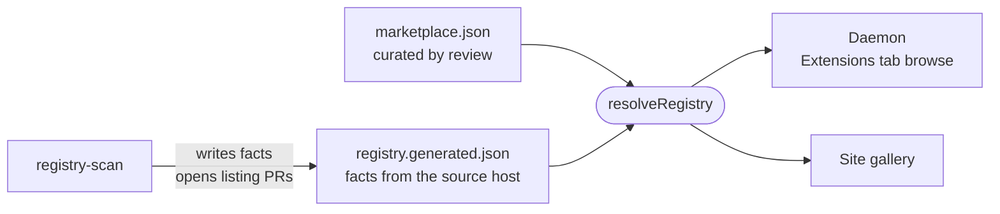

# registry

The file format of an extension registry, a git repository of sha-pinned pointers with curated trust and scanned facts, read the same way by the daemon, the site gallery and the scanner.



- A registry is a git repo, not a service. `marketplace.json` is Claude Code's plugin-marketplace format plus
  intentic's `kind` and `trust` fields, edited by hand. `registry.generated.json` holds only facts the scanner read, in
  a separate file so a nightly refresh never conflicts with a review.
- `resolveSource` maps an entry's `source` onto the url, ref and path an install clones. A shape it cannot clone, such
  as npm, becomes "not installable" instead of failing the whole file.
- Trust is `listed`, `verified` or `blocked`. On the official registry a security review counts only for the exact
  sha, url and path an installer clones, and bumping a policy or scanner version marks every older review stale.
- `RegistryEntry` is also the daemon's browse wire shape, so the app and the site render the same row.

## Key files

- [src/registry.ts](src/registry.ts) — file schemas, trust, the admission record and `resolveRegistry`.
- [src/source.ts](src/source.ts) — `resolveSource`: an entry's pointer, resolved to something clonable.
- [src/registry.test.ts](src/registry.test.ts) — joining, trust and ordering, by example.
- [src/source.test.ts](src/source.test.ts) — which source shapes resolve and how.

## Commands

```sh
pnpm --filter @intentic/registry test
```
