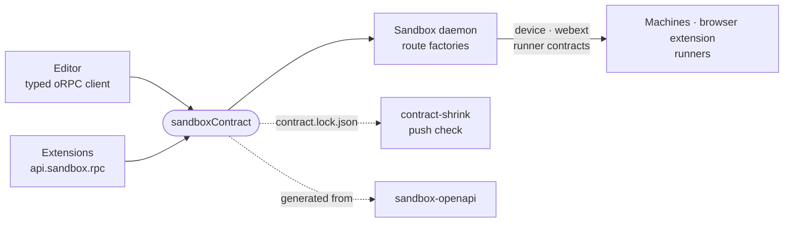

# sandbox-contract

The wire contract between the editor and the sandbox daemon: every route, its schemas and its access policy, as one oRPC contract both ends compile against.



- Each subject pairs a route group in `src/contracts/*.contract.ts` with its wire shapes in `src/schemas/`.
  `src/index.ts` assembles them into `sandboxContract`, which the daemon implements per domain and the browser calls
  through one typed client.
- Policy sits beside each route: `procedure()` declares how a request authenticates, which member tier it needs and how
  far a control token reaches. Routes outside oRPC (streams, WebSocket upgrades, `/health`) are listed in
  `RAW_ROUTES`.
- Three contracts run the other way. `deviceContract`, `webextContract` and `runnerContract` are served by a user's
  machine, the browser extension and a runner over the socket each one opens, with the daemon as the client.
- The daemon names the routes it implements on the `/events` hello frame, and the browser diffs that list against its
  own build, so a route an older daemon lacks shows as a missing feature instead of a 404.
- Some rules live here as code, not only shapes, because both ends must reach the same answer. The main one is
  whether an account can serve a turn: `serviceState` in `src/models/plan-pools.ts` turns a revoked sign-in, a lost
  seat, a translator bench, a standing refusal and the plan limits into one `AccountState` (`ready` · `spent` ·
  `blocked` with its `fix` · `unknown`), and `SPENT_UTILIZATION` is the only spent line. The daemon runs it for every
  picker and publishes it as `state` on each account row. The editor reads that field, and runs the same function only
  for a daemon too old to send it.
- `./documents` is the vocabulary stored files evolve by, shared by the daemon's stores and an extension's own files
  (`sandboxDocument`): guarded, pure conversions of raw JSON that settle on their own output, and the passthrough that
  keeps what a build does not know on its writes.
- The wire no oRPC route carries is defined by the Rust crates that speak it (`_sandbox/front/crates`): `tunnel` (the
  `/tunnel/v1` door, its headers, envelope, close codes, ALPN and the transports an edge declares), `browser-wire`
  (what a browser sees: the terminal socket and its messages, the WebTransport path, the edge's verdict) and
  `front-wire` (the front's control socket with Node). Their tests write TypeScript and a JSON manifest each into
  `src/front/generated/`; `src/front/browser-wire.ts` is the browser's entry to them, and `wire-manifests.test.ts` holds
  every value TypeScript restates to those manifests.
- `contract.lock.json` is every exported schema as canonical JSON Schema, plus those three manifests under `wire:`
  names, so a changed tunnel header or a gone control message is a shrink like any other. Rewrite it by hand with
  `pnpm --filter @intentic/sandbox-contract lock`. After a land that changed the contract, the land check's
  `pnpm verify` rewrites it in the main tree, where it waits as an uncommitted change. `src/state/contract-lock.test.ts`
  fails while the lock and the schemas disagree. `_tools/checks/contract-shrink.mjs` reports a push that shrinks it
  with no commit declaring the break (`type!:` or `Breaking-Note:`), and the push goes on.

## Key files

- [src/index.ts](src/index.ts) — `sandboxContract`, the route tables derived from it, and every public export.
- [src/protocol/route-meta.ts](src/protocol/route-meta.ts) — the per-route policy fields and their defaults.
- [src/protocol/raw-routes.ts](src/protocol/raw-routes.ts) — every route the daemon serves outside oRPC.
- [src/protocol/routes.ts](src/protocol/routes.ts) — route naming, `streamOf` for streamed routes, and the route list a daemon advertises.
- [contract.lock.json](contract.lock.json) — the committed fingerprint of the wire surface.
- [src/webext/index.ts](src/webext/index.ts) — a narrow entry point, one of several that keep small bundles off the barrel.

## Commands

```sh
pnpm --filter @intentic/sandbox-contract lock   # rebuild, then rewrite contract.lock.json
pnpm --filter @intentic/sandbox-contract test
```
