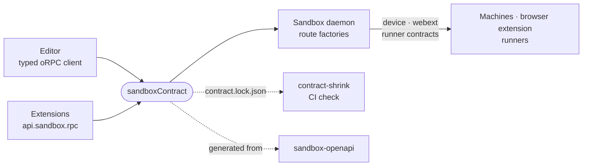

# sandbox-contract

The wire contract between the editor and the sandbox daemon: every route, its schemas and its access policy, as one oRPC contract both ends compile against.


```mermaid
flowchart LR
    web["Editor<br/>typed oRPC client"] --> contract(["sandboxContract"])
    ext["Extensions<br/>api.sandbox.rpc"] --> contract
    contract --> daemon["Sandbox daemon<br/>route factories"]
    daemon -- "device · webext<br/>runner contracts" --> peers["Machines · browser extension<br/>runners"]
    contract -. "contract.lock.json" .-> shrink["contract-shrink<br/>CI check"]
    contract -. "generated from" .-> openapi["sandbox-openapi"]
```

- Each subject pairs a route group in `src/contracts/*.contract.ts` with its wire shapes in `src/schemas/`.
  `src/index.ts` assembles them into `sandboxContract`, which the daemon implements per domain and the browser calls
  through one typed client.
- Policy sits beside each route: `procedure()` declares how a request authenticates, which member tier it needs and how
  far a control token reaches. Routes outside oRPC (streams, WebSocket upgrades, `/health`) are listed in
  `RAW_ROUTES`.
- Three contracts run the other way. `deviceContract`, `webextContract` and `runnerContract` are served by a user's
  machine, the browser extension and a runner over the socket each one opens, with the daemon as the client.
- The daemon names the routes it implements on the `/events` hello frame, and the browser diffs that list against its
  own build, so a route an older daemon lacks shows as a missing feature instead of a 404. The desktop app's folder
  sidecar sends the same frame with `surface: "folder"` and only the few routes it serves, which the browser offers
  and never reads as out of date.
- Some rules live here as code, not only shapes, because both ends must reach the same answer. The main one is
  whether an account can serve a turn: `serviceState` in `src/models/plan-pools.ts` turns a revoked sign-in, a lost
  seat, a translator bench, a standing refusal and the plan limits into one `AccountState` (`ready` · `spent` ·
  `blocked` with its `fix` · `unknown`), and `SPENT_UTILIZATION` is the only spent line. The daemon runs it for every
  picker and publishes it as `state` on each account row. The editor reads that field and never judges a row itself: a
  row without it (a daemon from before v1.313) reads as `unknown`, and the editor says the sandbox needs an update.
- `./documents` is the vocabulary stored files evolve by, shared by the daemon's stores and an extension's own files
  (`sandboxDocument`): guarded, pure conversions of raw JSON that settle on their own output, the passthrough that
  keeps what a build does not know on its writes, and `readDocument`, the one read every store makes of a file (JSON,
  conversions, parse, whole or one entry at a time), whose problems carry a `reason` a reader matches on.
- The sandbox's own transcript notices (a land, a memory hold, a renewal, a stop) keep their English sentence in
  `text`, which older editors, stored records and agents reading their own history go on reading, and carry
  `noticeCode` beside it: which notice it is and the facts it was worded from (`src/events/sandbox-notice.ts`), so the
  editor says it in the reader's language and audience. On the wire the code is any string; `SandboxNoticeSchema` is
  the typed list a reader decodes with, and a code it does not know draws `text`. (2026-09-29: a closed enum was
  rejected, since the editor parses every answer with its own schema and one newer code would fail the whole page.)
- `StatePlanSchema` and `StateStatusSchema` are what `ic` reads by field name: the update pre-flight's line (embedded
  verbatim in the staged-update marker) and `/health`'s `state`. `golden/` holds their examples, which the contract's
  test keeps current and ic's Rust tests parse.
- The wire no oRPC route carries is defined by the Rust crates that speak it (`_sandbox/front/crates`): `tunnel` (the
  `/tunnel/v2` door, its headers and lanes, the stream multiplexer, close codes, liveness, ALPN and the transports an
  edge declares; what the daemon announces as its transfers is `protocol/tunnel-bulk.ts`, held to the edge's reading by
  the shared `ingress-contract.fixture.json`), `browser-wire` (what a browser sees: the terminal socket and its messages, the front's vitals,
  the WebTransport path, the edge's verdict) and `front-wire` (the front's control socket with Node, its env vars and its patience). The
  vitals are read at the package root: `protocol/vitals.ts` gives `VITALS_PATH` and `parseVitals`, which reads any
  other body (an older sandbox's 404 from Node) as undefined. Their tests
  write TypeScript and a JSON manifest each into `src/front/generated/`; `src/front/browser-wire.ts` and
  `src/front/front-wire.ts` are the entries to them, and `wire-manifests.test.ts` holds every value TypeScript restates
  to those manifests.
- `contract.lock.json` is every exported schema as canonical JSON Schema, plus those three manifests under `wire:`
  names, so a changed tunnel header or a gone control message is a shrink like any other, plus who reaches each route
  under `access:METHOD /path`: every reach field of its `RouteMeta` with the default filled in (`routeAccess`). A
  field is recorded even when a route leaves it out, so a lowered floor or a new `guest`, `agent` or `panel` grant is a
  changed value, which counts as a shrink, never as growth that passes. The lock test names the route and the field
  that moved. Rewrite it by hand with `pnpm --filter @intentic/sandbox-contract lock`. A conversation that changed the
  contract has it rewritten in its own worktree before it lands (the repository's fixers,
  `_tools/scripts/verify/fixers.mjs`), so the lock rides the land that moved it. `src/state/contract-lock.test.ts`
  fails while the lock and the schemas disagree. `_tools/checks/contract-shrink.mjs` fails CI for a pushed branch
  that shrinks it with no commit declaring the break (`type!:` or `Breaking-Note:`); nothing checks the push itself.

## Key files

- [src/index.ts](src/index.ts) — `sandboxContract`, the route tables derived from it, and every public export.
- [src/protocol/route-meta.ts](src/protocol/route-meta.ts) — the per-route policy fields and their defaults.
- [src/protocol/raw-routes.ts](src/protocol/raw-routes.ts) — every route the daemon serves outside oRPC.
- [src/protocol/routes.ts](src/protocol/routes.ts) — route naming, `streamOf` for streamed routes, and the route list a daemon advertises.
- [contract.lock.json](contract.lock.json) — the committed fingerprint of the wire surface.
- [src/webext/index.ts](src/webext/index.ts) — a narrow entry point, one of several that keep small bundles off the barrel.

## Commands

```sh
pnpm --filter @intentic/sandbox-contract lock   # rebuild, then rewrite contract.lock.json
pnpm --filter @intentic/sandbox-contract test
```
