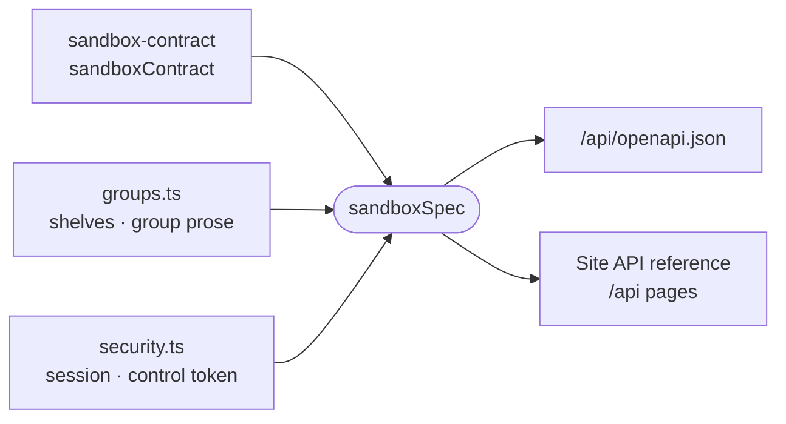

# sandbox-openapi

Generates the sandbox daemon's wire contract as one OpenAPI 3.1 document, which the site renders as its API reference and serves as `openapi.json`.

- Paths, methods and schemas are derived from `sandboxContract` when the site builds. No copy of the document is
  committed, since a route's change already shows in the contract's own diff.
- What the contract cannot state is authored here: the reading order and audience of each route group
  (`SPEC_GROUPS`, `SPEC_SHELVES`) and the two credentials, because authorization is middleware in the daemon rather
  than part of each route.
- `zodConverter` turns zod schemas into JSON Schema with `z.toJSONSchema`, keeping request and response shapes apart
  where `.default()` or `.stringbool()` makes them differ.
- `spec.test.ts` fails when a contract group has no entry in `groups.ts`, an entry has no routes, or two runs produce
  different documents.

## Key files

- [src/spec.ts](src/spec.ts) — `sandboxSpec` and `serializeSpec`: the document, generated from the contract.
- [src/groups.ts](src/groups.ts) — the hand-written groups and shelves the reference rail is built from.
- [src/security.ts](src/security.ts) — the session bearer and control-token schemes, with each token scope's reach.
- [src/converter.ts](src/converter.ts) — zod to JSON Schema for oRPC's OpenAPI generator.
- [src/spec.test.ts](src/spec.test.ts) — coverage, grouping and determinism, checked by walking the contract.
