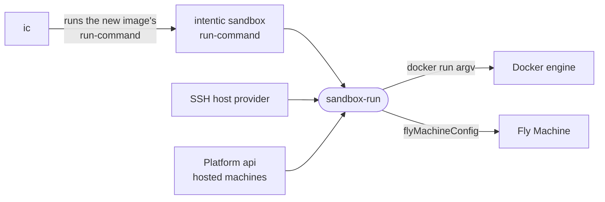

# sandbox-run

The sandbox container's run contract: names, privileges, resource caps, the env a recreate replays, and the `docker run` line and Fly Machine config built from them.

- One definition for every way a sandbox starts. TypeScript callers import it, so drift is a compile error. `ic`
  runs the target image's own `intentic sandbox run-command` and executes the line it prints, so each image starts
  with its own flags.
- Privilege arrives only through `RUNTIME_DIRECTIVES`, an allowlist read from an overlay's `# intentic:runtime` lines
  and the owner's `SANDBOX_RUNTIME`. An `OPTIONAL_DIRECTIVES` entry such as `--gpus=all` is probed on the host and
  dropped when the host cannot honour it.
- `REPLAY_ENV` is what a recreate carries over. `parseNulEnv` reads it NUL-framed because a value can be a multi-line
  private key.
- `localDaemonPort` derives a sandbox's host loopback port from its id, so a recreate lands on the same port and the
  editor and machine agent compute it without being told.
- `DATA_MOUNTS` names where a sandbox's stored data lives in its container and the state planner's flag for each; the
  update pre-flight in `ic` mounts exactly these, read-only, and its copy is held to `golden/data-mounts.json`.
- `./quote` holds the shell, SQL and env-file quoters the daemon, providers and CLI share.

## Key files

- [src/index.ts](src/index.ts) — names, capabilities, caps, directives, replay env and `sandboxRunArgv`.
- [src/fly.ts](src/fly.ts) — the hosted flavour: `flyMachineConfig` and the single-volume layout.
- [src/quote.ts](src/quote.ts) — quoters to compose outward, one per parser a value crosses.
- [src/index.test.ts](src/index.test.ts) — the emitted argv and directive handling, by example.
