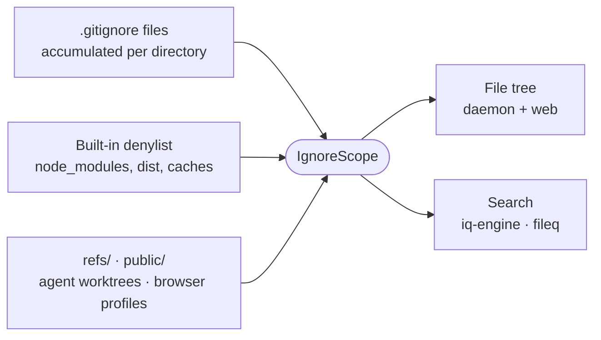

# workspace-ignore

Decides which paths in a workspace are project files and which are machine noise, so the file tree and search agree.

- Ignored means "not part of the tracked project". Ignored directories stay listed and lazy-load, so nothing is hidden and this is not a security boundary.
- The `./constants` entry point has no Node imports, so the browser bundle shares the same lists as the daemon.
- `refs/` and `public/` count only at the workspace root. A repository's own `public/` stays ordinary content.
- `descend()` treats a directory without a `.gitignore` as adding no rules, and rejects when one exists but cannot be read, since reading it as empty would count everything under it as tracked.

## Key files

- [src/index.ts](src/index.ts) — `createIgnoreScope`: layered `.gitignore` matching that descends with the directory walk.
- [src/constants.ts](src/constants.ts) — the denylist, the reserved top-level directories and the scanner prune globs.
- [src/index.test.ts](src/index.test.ts) — which paths count as ignored, by example.
